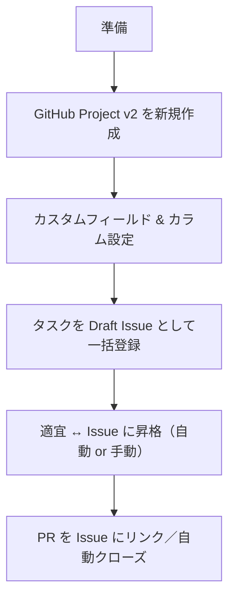

以下の手順を踏めば **「学校だよりAI」** の開発タスクを **GitHub Projects（Projects v2）** で一元管理し、Issue 化できます。
UI でクリックしても、CLI／API で自動化しても OK です。まず “全体像” → “最短ハンズオン手順” → “タスク一覧テンプレ (コピペ可)” の順にまとめました。

---

## 1. 全体像（ゴールと流れ）



* **Draft Issue** = Projects 内だけに存在する軽量カード
  ↳ 担当者が実装を始めるとき **Convert to Issue** ボタン or 自動ルールで Issue 化
* **Automation**:

  * “PR merged” で Status を “Done”
  * “Convert to Issue” 時点で Status を “In Progress” … など

---

## 2. 最短ハンズオン手順

| 手順                         | 操作                                                                                             | 補足                        |
| -------------------------- | ---------------------------------------------------------------------------------------------- | ------------------------- |
| **① 新規 Project 作成**        | GitHub → **Projects** → **＋ New project** → “Project (Beta)” を選択                               | Public/Private はリポジトリと揃える |
| **② ビュー設定**                | **Table ビュー**を最初に使うと一括貼り付けが楽                                                                   | Kanban ビューを後で追加可          |
| **③ カラム (Status) フィールド**   | 例：`Todo / In Progress / Review / Done`                                                         | デフォルトを “Todo” に           |
| **④ カスタムフィールド**            | `Owner (User)` `Block (Select)` `Due (Date)` など                                                | Block は後述タスク表の番号を入れると便利   |
| **⑤ タスクを Draft Issue で登録** | （方法A）下にある **Markdown表** をそのまま Table ビューにペースト→自動でカード生成<br>（方法B）`gh issue create` や CSV インポート    | 100 件まで同時貼り付け可            |
| **⑥ 自動ルール追加 (任意)**         | Project → **Automations**<br>- Issue 作成時 → `Status=In Progress`<br>- PR Merged → `Status=Done` | Workflow で自動化可            |
| **⑦ 追跡 & 運用**              | Kanban ビューでドラッグ／フィルタ<br>Burndown 欲しければ **Insights**                                            |                           |

### 👉 CLI で一括登録したい場合（例）

```bash
# gh CLI が前提
gh project create --title "学校だよりAI" --format table

# カスタムフィールド例（Status / Block / Due）
gh project field-create 1 --name "Block" --data-type single_select --options "1,2,3,4,5,6,7"
gh project field-create 1 --name "Due"   --data-type date

# Draft Issue を 1 件追加（ループで量産可）
gh project item-create 1 --title "STT連携: 録音→Google STT API" --field "Block=1" --field "Due=2025-06-10"
```

---

## 3. タスク一覧テンプレ（コピーして Table ビューにペースト）

| Title                                           | Block | Owner | Due  | Notes            |
| ----------------------------------------------- | ----- | ----- | ---- | ---------------- |
| **1. スマホ録音→STT**：Flutter プラグイン選定・録音 UI & API 連携 | 1     | 亀ちゃん  | 6/10 | 録音停止後に自動送信       |
| STT エラー処理 & Retries                             | 1     | 亀ちゃん  | 6/11 | ネット切断時キュー保存      |
| **2. ユーザー辞書＋Section 分けモジュール**（Python）           | 2     | 山谷    | 6/10 | 誤変換補正・見出し抽出      |
| Section モジュール API 化 & Flutter 呼び出し              | 2     | 亀ちゃん  | 6/11 | gRPC or REST     |
| **3. Gemini プロンプト実装**（HTML 制約付き）                | 3     | 亀ちゃん  | 6/11 | 試験入力→HTML構造テスト   |
| Gemini API ラッパー＋リトライ                            | 3     | 亀ちゃん  | 6/12 | 429/500 対応       |
| **4. Quill.js WebView 仮組み**                     | 4     | 亀ちゃん  | 6/09 | Snow テーマ確認       |
| Delta→HTML 整形関数（div/style 除去）                   | 4     | 山谷    | 6/12 | unit-test 必須     |
| **5. AI 補助 UI（ボタン型）**：挨拶文生成 / リライト              | 5     | 亀ちゃん  | 6/12 | Quill へ直接 insert |
| AI 補助 UI → 折りたたみ or モーダル実装                      | 5     | 亀ちゃん  | 6/13 | UX 調整            |
| **6. Firebase Firestore / Storage 設計**          | 6     | 亀ちゃん  | 6/10 | コレクション / セキュルール  |
| Save/Load API (HTML+delta)                      | 6     | 亀ちゃん  | 6/12 | 双方向同期            |
| **7. PDF 出力 + Drive 保存**（html-to-pdf）           | 7     | 亀ちゃん  | 6/13 | CSS 印刷調整         |
| Drive OAuth 設定 & Upload                         | 7     | 亀ちゃん  | 6/13 |                  |
| Classroom 共有 (Nice-to-Have)                     | 7     | 亀ちゃん  | 6/17 | 余裕あれば            |

> **使い方**
>
> 1. 上表を **コピー**→ GitHub Project の **Table** 先頭セルに **ペースト**。
> 2. 自動で Draft Issue が行単位で生成され、Block／Owner／Due がフィールドに入ります。
> 3. 実装に着手したらカード上で **Convert to Issue** → Kanban ビューでステータスを流す。

---

## 4. ラベル & Issue テンプレ

```yaml
# .github/ISSUE_TEMPLATE/dev_task.yaml
name: Dev Task
description: 開発タスク用テンプレ
title: "[Block X] <task title>"
labels: ["dev", "block/X", "status/todo"]
body:
  - type: textarea
    id: detail
    attributes:
      label: 詳細
      description: ゴール, 受入基準, 実装メモ など
  - type: markdown
    attributes:
      value: |
        ### Doneの定義
        - [ ] コード & テスト完了
        - [ ] PR マージ
        - [ ] Project ステータス = Done
```

---

## 5. 運用 Tips

1. **Draft Issue で荒く貼り付け → 着手時に Issue 昇格** が Projects v2 の王道。
2. **GitHub Actions or `gh` CLI** で「CSV → Draft Issue」自動追加も可能。
3. **`status/*` ラベルと Project Status を自動同期**させると PR 一覧が見やすい。
4. 毎朝 or 毎 MTG 前に **Table ビューを “Due 昇順” で並べ替え**＝遅延タスクが一目で分かる。
5. Project Insights の **Burndown** を使うなら Milestone を切る or Field でバーンダウン対象を限定。

---

これで **GitHub Projects + Issue 化の初期セットアップ** が完了します。
上記 Markdown を **プロジェクト Docs / Notion / README** に貼り付け → そのまま手順通りに操作すれば運用をスタートできます。

ハッカソン期間でも **Status カラムを動かすだけで進捗が “見える化”** されるので、ぜひ活用してください 💪