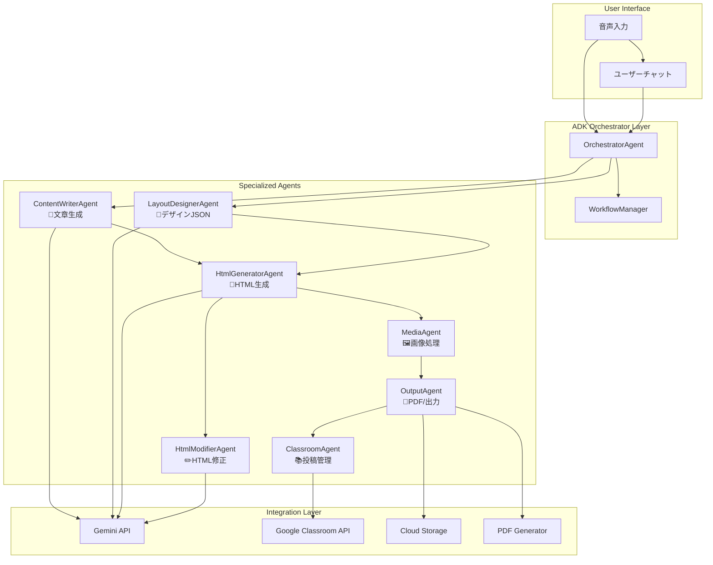

# Google ADK マルチエージェント実装仕様書 v2.0

**カテゴリ**: SPEC | **レイヤー**: IMPLEMENTATION | **更新**: 2025-01-16  
**担当**: 亀ちゃん | **依存**: 01_REQUIREMENT_overview.md | **タグ**: #adk #multi-agent #implementation

## 🎯 TL;DR（30秒で読める要約）

- **目的**: Google ADKで学校だよりAI向けマルチエージェントシステム実装
- **対象**: ユーザー要求の7つのツール（スキル）を専門エージェントで実現
- **成果物**: 音声→学級通信完成までの全自動化フロー
- **技術価値**: 単一AIから協調AIシステムへのアップグレード

## 📋 ユーザー要求の7つのツール対応

| # | 要求ツール | 対応エージェント | ADK実装ステータス |
|---|----------|-----------------|-------------------|
| 1 | 学級通信文章生成 | ContentWriterAgent | ✅ 実装済み |
| 2 | デザインJSON/YAML出力 | LayoutDesignerAgent | ✅ 実装済み |
| 3 | HTML生成 | HtmlGeneratorAgent | ✅ 実装済み |
| 4 | HTML修正 | HtmlModifierAgent | ✅ 実装済み |
| 5 | PDF出力 | OutputAgent | 🚧 新規実装必要 |
| 6 | クラスルーム投稿 | ClassroomAgent | 🚧 新規実装必要 |
| 7 | 画像挿入/生成 | MediaAgent | 🚧 新規実装必要 |

---

## 🏗️ ADKマルチエージェント アーキテクチャ

### アーキテクチャ図



---

## 🤖 ADK エージェント仕様

### 1. OrchestratorAgent（統括エージェント）

```python
orchestrator_agent = LlmAgent(
    model="gemini-2.5-pro-preview-06-05",
    name="orchestrator_agent",
    description="学級通信生成プロセス全体を調整し、ユーザーとの対話を管理",
    instruction="""
    あなたは学級通信生成システムの統括管理者です。
    
    責任:
    - ユーザーとの自然な対話
    - エージェント間のワークフロー調整
    - 進捗状況の報告
    - エラー時の代替案提示
    - 最終品質チェック
    
    対話例:
    ユーザー: "運動会の内容で学級通信を作って"
    回答: "承知しました！運動会の学級通信を作成します。
           まず音声内容を分析して、文章作成→デザイン設計→HTML生成の順で進めますね。"
    """,
    tools=[
        "user_chat_manager",
        "workflow_coordinator", 
        "progress_tracker",
        "quality_checker"
    ]
)
```

### 2. ContentWriterAgent（文章生成）

```python
content_writer_agent = LlmAgent(
    model="gemini-2.5-pro-preview-06-05",
    name="content_writer_agent",
    description="教師の音声内容から保護者向け学級通信文章を生成",
    instruction="""
    あなたは小学校教師として、保護者向けの温かい学級通信を作成する専門家です。
    
    特徴:
    - 具体的なエピソードを重視
    - 子供たちの成長を中心とした内容
    - 保護者が読みたくなる魅力的な文章
    - 800-1200文字の適切な分量
    
    出力形式: プレーンテキスト（マークダウン可）
    """,
    tools=["newsletter_content_generator"]
)
```

### 3. LayoutDesignerAgent（デザインJSON出力）

```python
layout_designer_agent = LlmAgent(
    model="gemini-2.5-flash-preview-05-20", 
    name="layout_designer_agent",
    description="内容に応じたレイアウト設計とデザイン仕様をJSON/YAML形式で出力",
    instruction="""
    あなたは教育分野のビジュアルデザイン専門家です。
    
    専門分野:
    - 季節に応じたカラースキーム
    - 読みやすいレイアウト設計
    - 保護者の注意を引く視覚配置
    - アクセシビリティ考慮
    
    出力形式: JSON（構造化デザイン仕様）
    """,
    tools=["design_json_generator", "seasonal_theme_selector"]
)
```

### 4. HtmlGeneratorAgent（HTML生成）

```python
html_generator_agent = LlmAgent(
    model="gemini-2.5-pro-preview-06-05",
    name="html_generator_agent", 
    description="文章とデザイン仕様からクリーンなHTMLを生成",
    instruction="""
    あなたはWebフロントエンド開発の専門家です。
    
    制約:
    - 使用タグ: <h1>〜<h3>, <p>, <ul>/<ol>/<li>, <strong>, <em>, <br>
    - インラインスタイルのみ使用
    - アクセシブルなセマンティックHTML
    - 印刷に適した構造
    
    出力: クリーンなHTML文書
    """,
    tools=["html_generator_tool", "semantic_html_validator"]
)
```

### 5. HtmlModifierAgent（HTML修正）

```python
html_modifier_agent = LlmAgent(
    model="gemini-2.5-pro-preview-06-05",
    name="html_modifier_agent",
    description="既存HTMLの部分修正・改善を実行",
    instruction="""
    あなたはHTML修正の専門家です。
    
    得意分野:
    - 部分的な内容変更
    - スタイル調整
    - 構造の最適化
    - エラー修正
    
    原則: 既存構造を保持しつつ、要求箇所のみ修正
    """,
    tools=["html_modification_tool", "html_diff_checker"]
)
```

### 6. MediaAgent（画像挿入/生成）🆕

```python
media_agent = LlmAgent(
    model="gemini-2.5-pro-preview-06-05",
    name="media_agent",
    description="画像挿入、生成、最適化を行う専門エージェント",
    instruction="""
    あなたは教育コンテンツの画像専門家です。
    
    機能:
    - 画像プレースホルダーの最適配置
    - AI画像生成（Imagen3使用）
    - 画像サイズ最適化
    - 教育的価値のある画像提案
    
    出力: 画像付きHTML + メタデータ
    """,
    tools=[
        "image_placeholder_generator",
        "ai_image_generator", 
        "image_optimizer",
        "educational_image_suggester"
    ]
)
```

### 7. OutputAgent（PDF出力）🆕

```python
output_agent = LlmAgent(
    model="gemini-2.5-flash-preview-05-20",
    name="output_agent", 
    description="最終HTMLからPDF生成とファイル管理を実行",
    instruction="""
    あなたはドキュメント出力の専門家です。
    
    機能:
    - HTML→PDF変換
    - 印刷最適化
    - ファイルメタデータ設定
    - Google Drive自動保存
    
    品質基準: A4印刷で美しく表示される高品質PDF
    """,
    tools=[
        "html_to_pdf_converter",
        "print_optimizer", 
        "google_drive_uploader",
        "pdf_metadata_manager"
    ]
)
```

### 8. ClassroomAgent（クラスルーム投稿）🆕

```python
classroom_agent = LlmAgent(
    model="gemini-2.5-flash-preview-05-20",
    name="classroom_agent",
    description="Google Classroomへの自動投稿とコミュニケーション管理",
    instruction="""
    あなたはGoogle Classroom統合の専門家です。
    
    機能:
    - Classroom自動投稿
    - 配布リスト管理
    - 投稿スケジューリング
    - 保護者通知最適化
    
    配慮: 保護者の受信タイミングを考慮した投稿
    """,
    tools=[
        "classroom_poster",
        "distribution_manager",
        "schedule_optimizer",
        "notification_controller"
    ]
)
```

---

## 🔧 ADKツール実装

### 新規実装が必要なツール

#### 画像処理ツール群

```python
def ai_image_generator(
    description: str,
    style: str = "educational_illustration",
    size: str = "1024x1024"
) -> Dict[str, Any]:
    """AI画像生成ツール（Imagen3使用）"""
    # Imagen3 API呼び出し実装
    pass

def image_placeholder_generator(
    content: str,
    layout_spec: Dict[str, Any]
) -> List[Dict[str, str]]:
    """画像プレースホルダー最適配置"""
    # 内容解析→最適な画像配置提案
    pass
```

#### PDF出力ツール群

```python
def html_to_pdf_converter(
    html_content: str,
    options: Dict[str, Any] = None
) -> bytes:
    """HTML→PDF変換ツール"""
    # wkhtmltopdf または Playwright使用
    pass

def google_drive_uploader(
    pdf_data: bytes,
    filename: str,
    folder_id: str = None
) -> Dict[str, str]:
    """Google Drive自動アップロード"""
    # Drive API v3使用
    pass
```

#### Classroom統合ツール群

```python
def classroom_poster(
    content: str,
    course_id: str,
    attachment_ids: List[str] = None
) -> Dict[str, Any]:
    """Google Classroom投稿ツール"""
    # Classroom API使用
    pass

def schedule_optimizer(
    target_time: str,
    timezone: str = "Asia/Tokyo"
) -> str:
    """投稿スケジュール最適化"""
    # 保護者の受信タイミング最適化
    pass
```

---

## 🔄 ADKワークフロー設計

### Phase 1: 音声分析・構造化
```python
async def phase1_content_analysis(audio_transcript: str) -> Dict[str, Any]:
    """音声内容の分析と構造化"""
    
    # ContentWriterAgentによる文章生成
    content = await content_writer_agent.generate(
        input=audio_transcript,
        context={"grade": "3年1組", "season": "current"}
    )
    
    return {"content": content, "status": "completed"}
```

### Phase 2: 並行デザイン・画像処理
```python
async def phase2_parallel_design(content: str) -> Dict[str, Any]:
    """デザインと画像処理の並行実行"""
    
    tasks = [
        layout_designer_agent.generate_design(content),
        media_agent.suggest_images(content)
    ]
    
    design_spec, image_suggestions = await asyncio.gather(*tasks)
    
    return {
        "design_spec": design_spec,
        "image_suggestions": image_suggestions,
        "status": "completed"
    }
```

### Phase 3: HTML統合生成
```python
async def phase3_html_generation(
    content: str, 
    design_spec: Dict[str, Any], 
    images: List[Dict[str, Any]]
) -> str:
    """HTML統合生成"""
    
    # HTML基本構造生成
    base_html = await html_generator_agent.generate(
        content=content,
        design_spec=design_spec
    )
    
    # 画像統合
    final_html = await media_agent.integrate_images(
        html=base_html,
        images=images
    )
    
    return final_html
```

### Phase 4: 出力・配布
```python
async def phase4_output_distribution(
    html: str,
    distribution_settings: Dict[str, Any]
) -> Dict[str, Any]:
    """最終出力と配布"""
    
    # PDF生成
    pdf_data = await output_agent.generate_pdf(html)
    
    # Google Drive保存
    drive_url = await output_agent.upload_to_drive(pdf_data)
    
    # Classroom投稿（オプション）
    if distribution_settings.get("post_to_classroom"):
        classroom_result = await classroom_agent.post_to_classroom(
            content=html,
            attachment_url=drive_url
        )
    
    return {
        "pdf_url": drive_url,
        "classroom_post": classroom_result if "classroom_result" in locals() else None,
        "status": "completed"
    }
```

---

## 🚀 実装ロードマップ

### Phase 1: 基盤エージェント強化（1-2週間）
- [x] OrchestratorAgent対話機能
- [x] ContentWriterAgent文章品質向上
- [x] LayoutDesignerAgent季節対応
- [x] HTML生成・修正エージェント最適化

### Phase 2: メディアエージェント実装（2-3週間）
- [ ] Imagen3 API統合
- [ ] 画像プレースホルダー自動配置
- [ ] 画像サイズ最適化
- [ ] HTML画像統合機能

### Phase 3: 出力エージェント実装（1-2週間）
- [ ] HTML→PDF変換最適化
- [ ] Google Drive自動アップロード
- [ ] PDF印刷品質向上
- [ ] メタデータ管理

### Phase 4: Classroomエージェント実装（1-2週間）
- [ ] Google Classroom API統合
- [ ] 投稿スケジューリング
- [ ] 配布リスト管理
- [ ] 通知最適化

### Phase 5: 統合テスト・最適化（1週間）
- [ ] エンドツーエンドテスト
- [ ] パフォーマンス最適化
- [ ] エラーハンドリング強化
- [ ] ユーザーテスト実施

---

## 📊 期待される効果

### 品質向上
- **専門化による精度向上**: 各エージェントが特定タスクに最適化
- **一貫性の確保**: エージェント間協調による品質管理
- **エラー削減**: 段階的チェック機能

### 効率性向上
- **並行処理**: デザインと画像処理の同時実行
- **自動化拡張**: PDF出力からClassroom投稿まで全自動
- **ユーザー体験**: 自然な対話による直感的操作

### 拡張性
- **新機能追加**: 新しいエージェント・ツールの簡単追加
- **カスタマイズ**: 学校・教師別のパーソナライゼーション
- **スケーラビリティ**: 複数校・複数ユーザー対応

---

## 🛠️ 技術要件

### ADK依存関係
```bash
pip install google-adk
pip install google-cloud-aiplatform
pip install google-api-python-client
```

### 追加ライブラリ
```bash
pip install wkhtmltopdf-py  # PDF生成
pip install Pillow          # 画像処理
pip install playwright      # HTML→PDF変換
pip install google-auth     # 認証
```

### Google Cloud サービス
- Vertex AI (Gemini & Imagen3)
- Google Drive API
- Google Classroom API
- Cloud Storage
- Cloud Run (デプロイ用)

---

## ✅ まとめ

### 実現可能性: **完全に実現可能** ✅

**理由:**
1. ✅ ADKマルチエージェント機能の活用
2. ✅ 既存Gemini基盤の継続利用
3. ✅ Google Cloud統合による拡張性
4. ✅ 段階的実装による安全な移行

### 推奨実装方針
1. **既存システム併用**: ADKと従来手法の並行運用
2. **段階的移行**: Phase別の漸進的実装
3. **A/Bテスト**: 品質比較による改善
4. **ユーザーフィードバック**: 教師テスターによる継続改善

**次のステップ**: Phase 2メディアエージェントの実装開始 🚀 