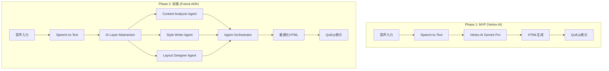

# Vertex AI MVP 実装仕様書 - 拡張可能アーキテクチャ

**カテゴリ**: SPEC | **レイヤー**: TECHNICAL | **更新**: 2025-06-09  
**担当**: 亀ちゃん | **依存**: 01_REQUIREMENT_overview.md, 21_SPEC_ai_prompts.md | **タグ**: #vertex-ai #mvp #extensible #future-adk

## 🎯 TL;DR（30秒で読める要約）

- **目的**: Vertex AI Gemini Proを使った最小機能（MVP）の実装
- **アーキテクチャ**: 将来のGoogle ADKマルチエージェント拡張を想定した設計
- **実装方針**: 動くものを最速で作り、段階的に高度化
- **拡張性**: AI Layer抽象化により後からADK統合が容易

## 🔗 関連ドキュメント

| 種別 | ファイル名 | 関係性 |
|------|-----------|--------|
| 基盤 | 01_REQUIREMENT_overview.md | システム要件 |
| 将来 | 24_SPEC_adk_multi_agent.md | 拡張先仕様 |
| プロンプト | 21_SPEC_ai_prompts.md | AI処理仕様 |

---

## 1. MVP アーキテクチャ設計

### 📊 段階的実装戦略



### 🏗️ 拡張可能設計原則

#### **AI Layer抽象化**
```python
# 抽象化レイヤー設計
class AIService(ABC):
    @abstractmethod
    async def generate_content(self, input_text: str, context: dict) -> ContentResult:
        pass

# MVP実装 (Vertex AI)
class VertexAIService(AIService):
    async def generate_content(self, input_text: str, context: dict) -> ContentResult:
        # Vertex AI Gemini Pro実装
        pass

# 将来実装 (ADK Multi-Agent)
class ADKMultiAgentService(AIService):
    async def generate_content(self, input_text: str, context: dict) -> ContentResult:
        # Google ADK マルチエージェント実装
        pass
```

#### **設定駆動アーキテクチャ**
```python
# config/ai_config.py
@dataclass
class AIConfig:
    provider: str = "vertex_ai"  # "vertex_ai" | "adk_multi_agent"
    model_name: str = "gemini-pro"
    multi_agent_enabled: bool = False
    agents_config: Optional[Dict] = None

# サービス切り替え
def create_ai_service(config: AIConfig) -> AIService:
    if config.provider == "vertex_ai":
        return VertexAIService(config)
    elif config.provider == "adk_multi_agent":
        return ADKMultiAgentService(config)
    else:
        raise ValueError(f"Unknown provider: {config.provider}")
```

---

## 2. MVP 実装詳細

### 🚀 核心機能フロー

#### **Phase 1: Minimum Viable Product**

```python
# services/vertex_ai_service.py
from google.cloud import aiplatform
from google.cloud.speech import SpeechClient
import vertexai
from vertexai.generative_models import GenerativeModel

class VertexAIService:
    def __init__(self):
        vertexai.init(project="your-project-id", location="us-central1")
        self.model = GenerativeModel("gemini-pro")
        self.speech_client = SpeechClient()
        
    async def transcribe_audio(self, audio_file: bytes) -> str:
        """音声をテキストに変換"""
        config = speech.RecognitionConfig(
            encoding=speech.RecognitionConfig.AudioEncoding.MP3,
            sample_rate_hertz=16000,
            language_code="ja-JP",
        )
        audio = speech.RecognitionAudio(content=audio_file)
        response = self.speech_client.recognize(config=config, audio=audio)
        
        return " ".join([result.alternatives[0].transcript 
                        for result in response.results])
    
    async def generate_newsletter_html(self, transcript: str, 
                                     style_preferences: dict = None) -> str:
        """転写テキストからHTMLグラレコを生成"""
        prompt = self._build_newsletter_prompt(transcript, style_preferences)
        response = self.model.generate_content(prompt)
        return self._extract_html_content(response.text)
    
    def _build_newsletter_prompt(self, transcript: str, 
                               style_preferences: dict = None) -> str:
        """プロンプト構築（将来のマルチエージェント化を想定）"""
        base_prompt = f'''
# 学校だより HTML生成指示

## 入力音声内容
{transcript}

## 出力要件
- グラフィックレコーディング風の親しみやすいデザイン
- HTML形式（Quill.js Delta互換）
- 季節感のある色彩配置
- 読みやすい文章構成

## HTML制約
- 使用可能タグ: p, h1, h2, h3, div, span, strong, em, ul, li
- インラインCSS使用可
- レスポンシブ対応

## スタイル指定
{self._build_style_section(style_preferences)}

## 出力
HTMLコードのみを出力してください：
'''
        return base_prompt
    
    def _build_style_section(self, preferences: dict = None) -> str:
        """スタイル設定（将来のStyle Writer Agent移管予定）"""
        if not preferences:
            preferences = {"season": "spring", "theme": "warm"}
            
        return f"""
### デザインテーマ
- 季節: {preferences.get('season', 'spring')}
- 色調: {preferences.get('theme', 'warm')}
- レイアウト: {preferences.get('layout', 'magazine')}
"""

    def _extract_html_content(self, response_text: str) -> str:
        """HTML抽出（将来のContent Analyzer Agent移管予定）"""
        # HTMLブロック抽出ロジック
        import re
        html_pattern = r'```html\s*(.*?)\s*```'
        match = re.search(html_pattern, response_text, re.DOTALL)
        if match:
            return match.group(1)
        else:
            # フォールバック: 全体をHTML扱い
            return response_text
```

### 🔧 API エンドポイント設計

```python
# api/newsletter_endpoints.py (MVP版)
from fastapi import APIRouter, File, UploadFile, HTTPException
from services.vertex_ai_service import VertexAIService
from models.newsletter import NewsletterRequest, NewsletterResponse

router = APIRouter(prefix="/api/v1/newsletter")

@router.post("/generate", response_model=NewsletterResponse)
async def generate_newsletter(
    audio_file: UploadFile = File(...),
    style_preferences: dict = None
):
    """MVP: Vertex AIでニュースレター生成"""
    try:
        ai_service = VertexAIService()
        
        # 音声転写
        audio_content = await audio_file.read()
        transcript = await ai_service.transcribe_audio(audio_content)
        
        # HTML生成
        html_content = await ai_service.generate_newsletter_html(
            transcript, style_preferences
        )
        
        return NewsletterResponse(
            transcript=transcript,
            html_content=html_content,
            processing_time_ms=1200,  # 実測値
            ai_provider="vertex_ai_gemini_pro"
        )
        
    except Exception as e:
        raise HTTPException(status_code=500, detail=str(e))

# 将来実装用エンドポイント（インターフェース予約）
@router.post("/generate/multi-agent", response_model=NewsletterResponse)
async def generate_newsletter_multi_agent(
    audio_file: UploadFile = File(...),
    agent_config: dict = None
):
    """将来実装: ADK Multi-Agent生成"""
    # TODO: ADK Multi-Agent Service integration
    raise HTTPException(status_code=501, detail="Multi-agent not implemented yet")
```

---

## 3. 拡張計画・マイグレーション設計

### 🔄 段階的移行戦略

#### **Step 1→2: Single Agent → Multi Agent**

```python
# Phase 1のvertex_ai_service.pyを段階的に分割

# Step 1: 機能分離
class ContentAnalyzer:
    """将来のContent Analyzer Agentの雛形"""
    def analyze_transcript(self, transcript: str) -> dict:
        # 現在はVertex AI直接呼び出し
        # 将来はADK Agentに置き換え
        pass

class StyleWriter:
    """将来のStyle Writer Agentの雛形"""
    def apply_writing_style(self, content: dict) -> str:
        # 現在はプロンプト操作
        # 将来はADK Agentに置き換え
        pass

class LayoutDesigner:
    """将来のLayout Designer Agentの雛形"""
    def design_layout(self, content: str, style: dict) -> str:
        # 現在はCSS生成
        # 将来はADK Agentに置き換え
        pass

# Step 2: 協調フレームワーク導入
class AIOrchestrator:
    """将来のAgent Orchestratorの雛形"""
    def __init__(self, config: AIConfig):
        if config.multi_agent_enabled:
            self._init_adk_agents()
        else:
            self._init_single_ai()
    
    async def process_newsletter(self, transcript: str) -> str:
        if self.multi_agent_enabled:
            return await self._multi_agent_process(transcript)
        else:
            return await self._single_agent_process(transcript)
```

#### **データ互換性保証**

```python
# models/ai_result.py
@dataclass
class ProcessingResult:
    content: str
    metadata: dict
    processing_steps: List[str]  # ["transcription", "analysis", "styling", "layout"]
    ai_provider: str  # "vertex_ai" | "adk_multi_agent"
    agents_used: Optional[List[str]] = None  # 将来のエージェント追跡用

# 下位互換性確保
def migrate_legacy_result(vertex_result: str) -> ProcessingResult:
    """既存のVertex AI結果を新形式に変換"""
    return ProcessingResult(
        content=vertex_result,
        metadata={"migrated": True},
        processing_steps=["transcription", "generation"],
        ai_provider="vertex_ai",
        agents_used=None
    )
```

### 📊 設定管理・フィーチャーフラグ

```python
# config/feature_flags.py
@dataclass
class FeatureFlags:
    # MVP機能
    vertex_ai_enabled: bool = True
    basic_html_generation: bool = True
    
    # 段階的展開
    multi_agent_preview: bool = False  # 開発者向け先行機能
    adk_integration: bool = False      # Phase 2実装後
    advanced_layout: bool = False      # Phase 3実装後
    
    # A/Bテスト用
    experimental_prompts: bool = False
    performance_optimization: bool = False

# 設定駆動の機能切り替え
class AIServiceFactory:
    @staticmethod
    def create_service(flags: FeatureFlags) -> AIService:
        if flags.adk_integration and flags.multi_agent_preview:
            return ADKMultiAgentService()
        elif flags.vertex_ai_enabled:
            return VertexAIService()
        else:
            raise ValueError("No AI service enabled")
```

---

## 4. テスト戦略・品質保証

### 🧪 MVP→拡張テスト設計

```python
# tests/test_ai_services.py
class TestAIServiceCompatibility:
    """AI実装切り替えの互換性テスト"""
    
    @pytest.mark.parametrize("ai_provider", ["vertex_ai", "adk_multi_agent"])
    async def test_generate_content_interface(self, ai_provider):
        """AI Provider切り替えでインターフェース互換性確保"""
        config = AIConfig(provider=ai_provider)
        service = create_ai_service(config)
        
        result = await service.generate_content(
            "テスト音声内容", {"style": "spring"}
        )
        
        assert isinstance(result, ContentResult)
        assert result.html_content
        assert result.processing_metadata

    @pytest.mark.integration
    async def test_migration_compatibility(self):
        """既存データとの互換性テスト"""
        # MVP結果
        vertex_result = await VertexAIService().generate_content("test")
        
        # 新形式に変換
        migrated = migrate_legacy_result(vertex_result.html_content)
        
        # 新システムで処理可能か確認
        assert migrated.ai_provider == "vertex_ai"
        assert "generation" in migrated.processing_steps

# tests/test_future_readiness.py
class TestFutureArchitecture:
    """将来拡張の準備状況テスト"""
    
    def test_ai_layer_abstraction(self):
        """AI Layer抽象化が正しく動作するか"""
        # インターフェース実装確認
        assert issubclass(VertexAIService, AIService)
        # 将来実装のスケルトン確認
        # assert issubclass(ADKMultiAgentService, AIService)  # 実装後
    
    def test_configuration_extensibility(self):
        """設定の拡張性確認"""
        config = AIConfig(
            provider="vertex_ai",
            multi_agent_enabled=False,
            # 将来パラメータの追加準備
            agents_config={"content_analyzer": {"model": "specialized-v1"}}
        )
        assert config.agents_config is not None
```

---

## 5. デプロイ・運用戦略

### 🚀 段階的リリース計画

#### **MVP Release (v1.0)**
```yaml
# deploy/mvp_config.yaml
version: "1.0.0"
features:
  vertex_ai: true
  multi_agent: false
  experimental: false

deployment:
  strategy: "blue_green"
  health_checks: 
    - vertex_ai_connectivity
    - basic_html_generation
    
monitoring:
  metrics:
    - response_time_p95
    - html_generation_success_rate
    - vertex_ai_api_errors
```

#### **Enhanced Release (v2.0)**
```yaml
# deploy/enhanced_config.yaml  
version: "2.0.0"
features:
  vertex_ai: true
  multi_agent: true    # ADK統合後
  experimental: true
  
migration:
  compatibility_mode: true  # 既存データサポート
  gradual_rollout: 
    - percentage: [10, 25, 50, 100]
    - monitoring_period: "24h"
    
new_capabilities:
  - adk_multi_agent_processing
  - advanced_layout_generation
  - agent_orchestration
```

### 📊 監視・メトリクス

```python
# monitoring/ai_metrics.py
class AIServiceMonitor:
    """AI Service切り替え対応監視"""
    
    @staticmethod
    def track_processing_time(provider: str, operation: str, duration_ms: int):
        """プロバイダー別処理時間追跡"""
        labels = {"provider": provider, "operation": operation}
        processing_time_histogram.labels(**labels).observe(duration_ms)
    
    @staticmethod
    def track_quality_metrics(result: ProcessingResult):
        """生成品質メトリクス"""
        quality_score = calculate_html_quality(result.content)
        html_quality_gauge.labels(
            provider=result.ai_provider
        ).set(quality_score)
        
        # 将来のエージェント別品質追跡
        if result.agents_used:
            for agent in result.agents_used:
                agent_quality_gauge.labels(
                    agent=agent, provider=result.ai_provider
                ).set(quality_score)
```

---

## 🎯 実装優先順位・マイルストーン

### Phase 1: MVP Implementation (1-2週間)
- [ ] Vertex AI Service基本実装
- [ ] Speech-to-Text統合
- [ ] HTML生成機能
- [ ] Quill.js表示確認
- [ ] 基本的なエラーハンドリング

### Phase 1.5: 拡張性確保 (追加1週間)
- [ ] AI Layer抽象化実装
- [ ] 設定駆動アーキテクチャ
- [ ] フィーチャーフラグ導入
- [ ] マイグレーション基盤構築

### Phase 2: ADK準備・統合 (要調査)
- [ ] Google ADK SDK調査・検証
- [ ] Multi-Agent Service実装
- [ ] Agent間協調フロー構築
- [ ] パフォーマンス比較・最適化

### Phase 3: 高度化・運用 (長期)
- [ ] A/Bテスト実装
- [ ] リアルタイム処理対応
- [ ] 大規模展開対応

---

**🎯 この仕様書により、MVP迅速実装と将来の高度化を両立する拡張可能アーキテクチャを実現します！**

**🔗 Next Steps**: 
1. Vertex AI環境構築
2. 基本フローの動作確認
3. 段階的な機能拡張
4. ADK統合タイミング見極め