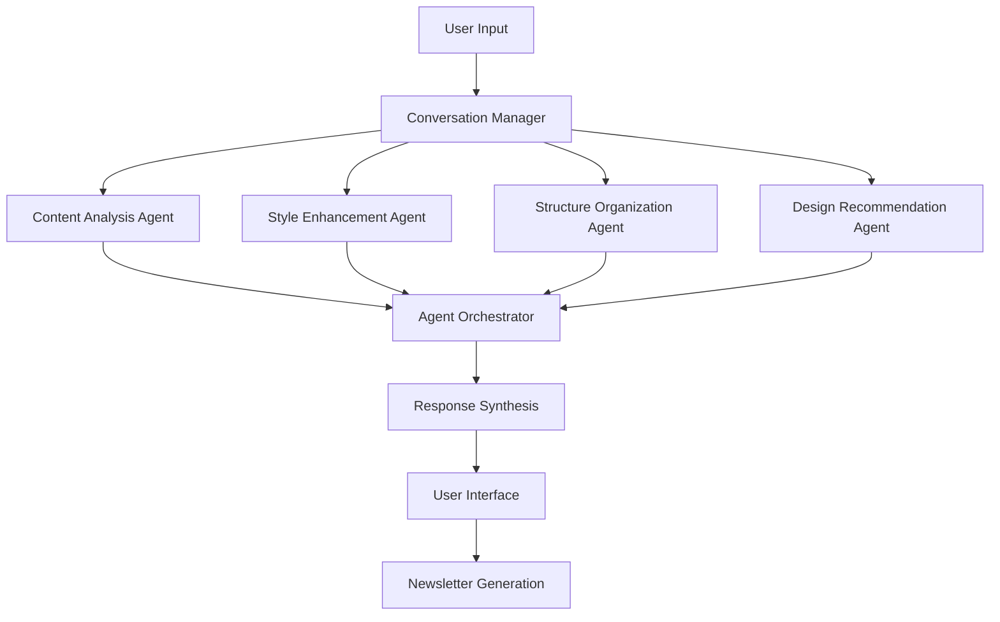

# 26_SPEC_google_adk_integration.md

**TL;DR**: Google ADK (Agent Development Kit) integration specification for 学校だよりAI, implementing multi-agent conversational AI system for enhanced newsletter creation workflow with chat-based user interaction.

## 📋 Document Metadata
- **Category**: SPEC (20-29)
- **Complexity**: High ⭐⭐⭐⭐
- **Reading Time**: 15 minutes
- **Dependencies**: Existing Gemini API service, Flutter Web architecture, Quill.js integration
- **Implementation Priority**: Medium (Enhancement feature)

---

## 🎯 Overview

This specification defines the integration of Google ADK (Agent Development Kit) into the 学校だよりAI system, enabling a multi-agent conversational AI approach for school newsletter creation. The enhancement transforms the current direct voice-to-newsletter workflow into an interactive, AI-assisted conversation experience.

### Current vs Enhanced Workflow

**Current**: `Voice → Speech-to-Text → Gemini → Quill.js → PDF`

**Enhanced**: `Chat Interface → Multi-Agent Conversation → Structure Proposal → User Approval → HTML Generation → Enhanced Editor → PDF Export → Google Classroom Distribution`

---

## 🏗️ Architecture Overview

### Multi-Agent System Design



### Service Layer Architecture

```
Frontend (Flutter Web)
├── AI Assistant Feature
│   ├── Conversation Provider (State Management)
│   ├── ADK Service (API Integration)
│   ├── Multi-Agent Orchestrator (Client-side)
│   └── Chat Interface (UI Components)
├── Enhanced Editor Feature
│   ├── Extended Quill.js Integration
│   ├── Advanced Formatting Tools
│   └── Image Generation Interface
└── Google Classroom Integration
    ├── Classroom API Service
    └── Distribution Management

Backend (Python FastAPI)
├── Multi-Agent System
│   ├── Agent Orchestrator
│   ├── Conversation Manager
│   └── Context Processor
├── Specialized Agents
│   ├── Content Analysis Agent
│   ├── Style Enhancement Agent
│   ├── Structure Organization Agent
│   └── Design Recommendation Agent
└── Google Services Integration
    ├── Enhanced Gemini Service
    ├── Classroom API Integration
    └── Image Generation Service
```

---

## 🤖 Multi-Agent System Specification

### Agent Definitions

#### 1. Content Analysis Agent
**Purpose**: Extract and analyze key information from user input

**Capabilities**:
- Parse voice/text input for newsletter content
- Identify key topics, events, and themes
- Extract dates, names, and important details
- Categorize content by newsletter sections

**Implementation**:
```python
class ContentAnalysisAgent:
    async def process_input(self, user_input: str, context: ConversationContext) -> ContentAnalysis:
        # Extract key information using NLP
        topics = await self.extract_topics(user_input)
        entities = await self.extract_entities(user_input)
        categories = await self.categorize_content(user_input)
        
        return ContentAnalysis(
            main_topics=topics,
            entities=entities,
            categories=categories,
            confidence_score=self.calculate_confidence(topics, entities)
        )
```

#### 2. Style Enhancement Agent
**Purpose**: Apply appropriate educational tone and language

**Capabilities**:
- Convert casual speech to professional educational language
- Apply school-appropriate tone and vocabulary
- Ensure parent-friendly communication style
- Maintain teacher persona consistency

**Implementation**:
```python
class StyleEnhancementAgent:
    async def enhance_style(self, content: ContentAnalysis, context: ConversationContext) -> StyledContent:
        # Apply educational tone using Gemini
        professional_tone = await self.apply_professional_tone(content.raw_text)
        parent_friendly = await self.make_parent_friendly(professional_tone)
        teacher_voice = await self.apply_teacher_persona(parent_friendly)
        
        return StyledContent(
            enhanced_text=teacher_voice,
            tone_adjustments=self.get_adjustments(),
            readability_score=self.calculate_readability(teacher_voice)
        )
```

#### 3. Structure Organization Agent
**Purpose**: Organize content into logical newsletter sections

**Capabilities**:
- Create section headers and organization
- Suggest newsletter structure based on content
- Balance content across sections
- Recommend additional content areas

**Implementation**:
```python
class StructureOrganizationAgent:
    async def organize_structure(self, styled_content: StyledContent, context: ConversationContext) -> NewsletterStructure:
        sections = await self.identify_sections(styled_content)
        structure = await self.create_structure(sections)
        suggestions = await self.suggest_improvements(structure)
        
        return NewsletterStructure(
            sections=structure,
            improvement_suggestions=suggestions,
            completeness_score=self.assess_completeness(structure)
        )
```

#### 4. Design Recommendation Agent
**Purpose**: Recommend visual design and layout options

**Capabilities**:
- Suggest Modern vs Classic template choice
- Recommend color schemes and visual elements
- Propose image placement and sizing
- Optimize layout for readability

**Implementation**:
```python
class DesignRecommendationAgent:
    async def recommend_design(self, structure: NewsletterStructure, context: ConversationContext) -> DesignRecommendation:
        template_choice = await self.recommend_template(structure, context.preferences)
        color_scheme = await self.suggest_colors(structure.theme)
        layout = await self.optimize_layout(structure.sections)
        
        return DesignRecommendation(
            template_type=template_choice,
            color_scheme=color_scheme,
            layout_suggestions=layout,
            visual_elements=await self.suggest_visual_elements(structure)
        )
```

### Agent Orchestration

```python
class MultiAgentOrchestrator:
    def __init__(self):
        self.agents = {
            'content_analysis': ContentAnalysisAgent(),
            'style_enhancement': StyleEnhancementAgent(),
            'structure_organization': StructureOrganizationAgent(),
            'design_recommendation': DesignRecommendationAgent()
        }
    
    async def process_conversation_turn(self, user_input: str, context: ConversationContext) -> AgentResponse:
        # Sequential agent processing
        content_analysis = await self.agents['content_analysis'].process_input(user_input, context)
        styled_content = await self.agents['style_enhancement'].enhance_style(content_analysis, context)
        structure = await self.agents['structure_organization'].organize_structure(styled_content, context)
        design = await self.agents['design_recommendation'].recommend_design(structure, context)
        
        return AgentResponse(
            content_analysis=content_analysis,
            styled_content=styled_content,
            structure=structure,
            design=design,
            next_questions=self.generate_follow_up_questions(structure),
            completion_status=self.assess_completion(structure)
        )
```

---

## 💬 Conversation Flow Specification

### Conversation States

```dart
enum ConversationState {
  initial,           // Welcome and template selection
  gathering,         // Collecting newsletter content
  structuring,       // Organizing content into sections
  reviewing,         // User review and approval
  generating,        // HTML newsletter generation
  editing,           // Split-screen editing mode
  finalizing,        // PDF generation and distribution
}
```

### Conversation Flow

#### Phase 1: Initial Setup
1. **Welcome Message**: AI introduces itself and explains the process
2. **Template Selection**: User chooses Modern or Classic design
3. **Context Gathering**: Basic information (class, date, etc.)

```dart
class ConversationInitializer {
  Future<ConversationContext> initializeConversation() async {
    return ConversationContext(
      sessionId: generateSessionId(),
      templateType: await promptTemplateSelection(),
      schoolInfo: await getSchoolContext(),
      userPreferences: await loadUserPreferences(),
      conversationState: ConversationState.initial
    );
  }
}
```

#### Phase 2: Content Gathering
1. **Open-ended Questions**: "What would you like to share with parents today?"
2. **Follow-up Probing**: AI asks clarifying questions based on responses
3. **Voice Integration**: Seamless voice input with existing audio service
4. **Content Validation**: AI confirms understanding of key points

```dart
class ContentGatheringFlow {
  Future<void> gatherContent(ConversationContext context) async {
    while (!isContentComplete(context)) {
      final userInput = await waitForUserInput();
      final agentResponse = await processWithAgents(userInput, context);
      
      await updateUI(agentResponse);
      context = context.copyWith(
        messages: [...context.messages, userInput, agentResponse],
        contentAnalysis: agentResponse.contentAnalysis
      );
    }
  }
}
```

#### Phase 3: Structure Proposal
1. **Structure Presentation**: AI presents organized newsletter structure
2. **Section Review**: User can modify or approve each section
3. **Missing Content**: AI suggests additional content if needed
4. **Final Approval**: User confirms the structure before generation

```dart
class StructureProposalWidget extends StatelessWidget {
  final NewsletterStructure structure;
  final Function(NewsletterStructure) onApprove;
  final Function(String, String) onModifySection;
  
  Widget build(BuildContext context) {
    return Column(
      children: [
        Text('📋 提案された構成'),
        ...structure.sections.map((section) => SectionCard(
          section: section,
          onModify: (newContent) => onModifySection(section.id, newContent)
        )),
        ApprovalButtons(
          onApprove: () => onApprove(structure),
          onRevise: () => requestRevisions()
        )
      ]
    );
  }
}
```

---

## 🎨 User Interface Specification

### Chat Interface Design

#### Layout Components
1. **Message List**: Scrollable conversation history
2. **Input Area**: Text input with voice button
3. **Agent Status**: Visual indicators of active agents
4. **Template Preview**: Side panel showing current template choice
5. **Progress Indicator**: Multi-step progress visualization

#### Chat Message Types
```dart
abstract class ChatMessage {
  final String id;
  final DateTime timestamp;
  final MessageType type;
}

class UserMessage extends ChatMessage {
  final String content;
  final bool isVoiceInput;
}

class AgentMessage extends ChatMessage {
  final String content;
  final String agentType;
  final List<ActionButton> actions;
  final Widget? customWidget; // For structure proposals, previews, etc.
}

class SystemMessage extends ChatMessage {
  final String content;
  final SystemMessageType systemType;
}
```

#### Voice Integration
```dart
class VoiceInputWidget extends StatefulWidget {
  final Function(String) onTranscriptionComplete;
  final ConversationContext context;
  
  Widget build(BuildContext context) {
    return Container(
      child: Column(
        children: [
          VoiceVisualizer(isRecording: _isRecording),
          VoiceButton(
            onStartRecording: () => _startVoiceRecording(),
            onStopRecording: () => _stopVoiceRecording(),
            isRecording: _isRecording
          ),
          if (_isTranscribing) TranscriptionProgress()
        ]
      )
    );
  }
}
```

### Split-Screen Transition

#### Animation Specification
```dart
class ChatToEditorTransition extends StatefulWidget {
  Widget build(BuildContext context) {
    return AnimatedBuilder(
      animation: _animationController,
      builder: (context, child) {
        return Row(
          children: [
            // Chat panel - animate to side
            AnimatedContainer(
              width: _getChatPanelWidth(),
              duration: Duration(milliseconds: 500),
              child: ChatInterface()
            ),
            // Editor panel - slide in from right
            AnimatedContainer(
              width: _getEditorPanelWidth(),
              duration: Duration(milliseconds: 500),
              child: EnhancedQuillEditor()
            )
          ]
        );
      }
    );
  }
}
```

---

## 🔧 Enhanced Editor Features

### Advanced Text Formatting

#### Font Size Control
```dart
class FontSizeControl extends StatelessWidget {
  final double currentSize;
  final Function(double) onSizeChanged;
  
  Widget build(BuildContext context) {
    return Row(
      children: [
        IconButton(
          icon: Icon(Icons.text_decrease),
          onPressed: () => onSizeChanged(currentSize - 2)
        ),
        Text('${currentSize.toInt()}pt'),
        IconButton(
          icon: Icon(Icons.text_increase),
          onPressed: () => onSizeChanged(currentSize + 2)
        ),
        Slider(
          value: currentSize,
          min: 8,
          max: 72,
          divisions: 32,
          onChanged: onSizeChanged
        )
      ]
    );
  }
}
```

#### Image Insertion and Generation

```dart
class ImageInsertionService {
  Future<ImageInsertResult> insertImage(ImageInsertMethod method) async {
    switch (method) {
      case ImageInsertMethod.upload:
        return await _uploadImage();
      case ImageInsertMethod.generate:
        return await _generateAIImage();
      case ImageInsertMethod.stock:
        return await _selectStockImage();
    }
  }
  
  Future<ImageInsertResult> _generateAIImage() async {
    final prompt = await _getImagePrompt();
    final imageUrl = await _aiImageService.generateImage(
      prompt: prompt,
      style: 'educational_illustration',
      size: ImageSize.newsletter
    );
    return ImageInsertResult(url: imageUrl, source: 'ai_generated');
  }
}
```

### Smart Editing Features

#### Context-Aware Suggestions
```dart
class SmartEditingProvider extends ChangeNotifier {
  List<EditingSuggestion> _suggestions = [];
  
  void onTextChanged(String text, int cursorPosition) {
    _generateSuggestions(text, cursorPosition);
  }
  
  Future<void> _generateSuggestions(String text, int position) async {
    final context = _extractContext(text, position);
    final suggestions = await _aiService.generateEditingSuggestions(
      text: text,
      context: context,
      suggestionTypes: ['grammar', 'style', 'content']
    );
    
    _suggestions = suggestions;
    notifyListeners();
  }
}
```

---

## 🎓 Google Classroom Integration

### Authentication and Setup

```dart
class GoogleClassroomService {
  GoogleAuthService _authService;
  ClassroomAPI _classroomAPI;
  
  Future<List<Classroom>> getUserClassrooms() async {
    final credentials = await _authService.getClassroomCredentials();
    return await _classroomAPI.listClassrooms(credentials);
  }
  
  Future<DistributionResult> distributeNewsletter({
    required String pdfUrl,
    required List<String> classroomIds,
    required NewsletterMetadata metadata
  }) async {
    final results = <ClassroomDistributionResult>[];
    
    for (final classroomId in classroomIds) {
      final result = await _distributeToclassroom(
        classroomId: classroomId,
        pdfUrl: pdfUrl,
        metadata: metadata
      );
      results.add(result);
    }
    
    return DistributionResult(
      successful: results.where((r) => r.success).length,
      failed: results.where((r) => !r.success).length,
      details: results
    );
  }
}
```

### Distribution Interface

```dart
class NewsletterDistributionPage extends StatefulWidget {
  Widget build(BuildContext context) {
    return Scaffold(
      appBar: AppBar(title: Text('学級通信を配布')),
      body: Column(
        children: [
          NewsletterPreviewCard(),
          ClassroomSelectionList(
            classrooms: _availableClassrooms,
            selectedClassrooms: _selectedClassrooms,
            onSelectionChanged: _updateSelection
          ),
          DistributionOptions(
            scheduledTime: _scheduledTime,
            attachments: _attachments,
            onOptionsChanged: _updateOptions
          ),
          DistributeButton(
            onPressed: _distributeNewsletter,
            enabled: _canDistribute()
          )
        ]
      )
    );
  }
}
```

---

## 🔄 Data Models and API Specifications

### Conversation Models

```dart
class ConversationContext {
  final String sessionId;
  final TemplateType templateType;
  final SchoolInfo schoolInfo;
  final UserPreferences userPreferences;
  final ConversationState state;
  final List<ChatMessage> messages;
  final NewsletterContent? currentContent;
  final NewsletterStructure? proposedStructure;
  
  ConversationContext copyWith({...}) => ...;
}

class NewsletterContent {
  final String mainTopic;
  final List<ContentSection> sections;
  final Map<String, dynamic> metadata;
  final ContentAnalysis analysis;
}

class ContentSection {
  final String id;
  final String title;
  final String content;
  final SectionType type;
  final int order;
  final List<String> suggestedImprovements;
}
```

### API Endpoints

#### Multi-Agent Conversation
```python
@app.post("/api/v1/ai/multi-agent-conversation")
async def start_multi_agent_conversation(request: ConversationRequest) -> ConversationResponse:
    """Initialize or continue multi-agent conversation"""
    pass

@app.post("/api/v1/ai/conversation/{session_id}/message")
async def send_conversation_message(session_id: str, message: MessageRequest) -> AgentResponse:
    """Send message in ongoing conversation"""
    pass

@app.get("/api/v1/ai/conversation/{session_id}")
async def get_conversation_state(session_id: str) -> ConversationState:
    """Get current conversation state"""
    pass
```

#### Structure Proposal and Approval
```python
@app.post("/api/v1/ai/conversation/{session_id}/propose-structure")
async def propose_newsletter_structure(session_id: str) -> StructureProposal:
    """Generate newsletter structure proposal"""
    pass

@app.post("/api/v1/ai/conversation/{session_id}/approve-structure")
async def approve_newsletter_structure(session_id: str, approval: StructureApproval) -> GenerationResult:
    """Approve structure and generate newsletter"""
    pass
```

#### Google Classroom Integration
```python
@app.get("/api/v1/classroom/classrooms")
async def get_user_classrooms(credentials: GoogleCredentials) -> List[Classroom]:
    """Get user's Google Classroom list"""
    pass

@app.post("/api/v1/classroom/distribute")
async def distribute_newsletter(distribution: DistributionRequest) -> DistributionResult:
    """Distribute newsletter to selected classrooms"""
    pass
```

---

## 🧪 Testing Strategy

### Unit Testing

#### Agent Testing
```python
class TestContentAnalysisAgent:
    async def test_extract_topics(self):
        agent = ContentAnalysisAgent()
        input_text = "今日は運動会の練習をしました。子どもたちはとても頑張っていました。"
        
        analysis = await agent.process_input(input_text, mock_context)
        
        assert "運動会" in analysis.main_topics
        assert analysis.confidence_score > 0.8
        assert "練習" in analysis.entities
```

#### Conversation Flow Testing
```dart
void main() {
  group('ConversationProvider Tests', () {
    testWidgets('should initialize conversation correctly', (tester) async {
      final provider = ConversationProvider();
      await provider.initializeConversation();
      
      expect(provider.state.conversationState, ConversationState.initial);
      expect(provider.state.sessionId, isNotEmpty);
    });
    
    testWidgets('should handle user message correctly', (tester) async {
      final provider = ConversationProvider();
      await provider.initializeConversation();
      
      await provider.sendMessage("今日は楽しい一日でした");
      
      expect(provider.state.messages.length, greaterThan(1));
      expect(provider.state.currentAgent, isNotNull);
    });
  });
}
```

### Integration Testing

#### Multi-Agent Workflow Testing
```python
class TestMultiAgentWorkflow:
    async def test_complete_conversation_flow(self):
        orchestrator = MultiAgentOrchestrator()
        
        # Start conversation
        response1 = await orchestrator.process_conversation_turn(
            "今日は子どもたちと楽しく学習しました",
            ConversationContext()
        )
        
        # Continue conversation
        response2 = await orchestrator.process_conversation_turn(
            "算数の授業で新しい概念を教えました",
            response1.context
        )
        
        # Verify workflow
        assert response2.structure.sections
        assert response2.completion_status > 0.7
```

### E2E Testing

#### Full Conversation Flow
```typescript
// Playwright E2E Test
test('complete newsletter creation via ADK conversation', async ({ page }) => {
  await page.goto('/ai-assistant');
  
  // Template selection
  await page.click('[data-testid="modern-template"]');
  
  // Start conversation
  await page.fill('[data-testid="chat-input"]', '今日は運動会の準備をしました');
  await page.click('[data-testid="send-button"]');
  
  // Wait for agent response
  await page.waitForSelector('[data-testid="agent-response"]');
  
  // Continue conversation
  await page.fill('[data-testid="chat-input"]', '子どもたちはとても頑張っていました');
  await page.click('[data-testid="send-button"]');
  
  // Approve structure
  await page.waitForSelector('[data-testid="structure-proposal"]');
  await page.click('[data-testid="approve-structure"]');
  
  // Verify editor transition
  await page.waitForSelector('[data-testid="quill-editor"]');
  await expect(page.locator('[data-testid="newsletter-content"]')).toBeVisible();
});
```

---

## 📊 Performance Requirements

### Response Time Targets
- **Agent Response**: < 2 seconds per agent processing
- **UI Transition**: < 500ms for chat to editor transition
- **Voice Processing**: < 3 seconds from speech to text
- **PDF Generation**: < 5 seconds for newsletter export

### Scalability Requirements
- **Concurrent Conversations**: Support 100+ simultaneous conversations
- **Memory Usage**: < 512MB per conversation session
- **API Rate Limits**: Respect Google Cloud API quotas
- **Storage**: Efficient conversation state persistence

### Monitoring and Analytics
```python
class ConversationAnalytics:
    def track_conversation_start(self, session_id: str, template_type: str):
        pass
    
    def track_agent_response_time(self, agent_type: str, response_time: float):
        pass
    
    def track_conversation_completion(self, session_id: str, success: bool):
        pass
    
    def track_user_satisfaction(self, session_id: str, rating: int):
        pass
```

---

## 🚀 Deployment Strategy

### Environment Configuration
```yaml
# docker-compose.yml for ADK services
version: '3.8'
services:
  adk-backend:
    build: ./backend
    environment:
      - GOOGLE_ADK_API_KEY=${ADK_API_KEY}
      - GEMINI_PROJECT_ID=${PROJECT_ID}
      - CONVERSATION_REDIS_URL=${REDIS_URL}
    ports:
      - "8080:8080"
  
  conversation-store:
    image: redis:7-alpine
    ports:
      - "6379:6379"
    volumes:
      - conversation_data:/data
```

### Feature Flags
```dart
class FeatureFlags {
  static const bool enableADKConversation = bool.fromEnvironment('ENABLE_ADK_CONVERSATION', defaultValue: false);
  static const bool enableVoiceInput = bool.fromEnvironment('ENABLE_VOICE_INPUT', defaultValue: true);
  static const bool enableImageGeneration = bool.fromEnvironment('ENABLE_IMAGE_GENERATION', defaultValue: false);
  static const bool enableClassroomIntegration = bool.fromEnvironment('ENABLE_CLASSROOM_INTEGRATION', defaultValue: false);
}
```

### Rollout Plan
1. **Alpha**: Internal testing with core team
2. **Beta**: Limited teacher pilot program (10-20 users)
3. **Staged Rollout**: Gradual release to all users
4. **Full Release**: Complete feature availability

---

## 📝 Documentation Requirements

### User Documentation
- **Conversation Guide**: How to effectively communicate with AI agents
- **Template Selection**: Differences between Modern and Classic templates
- **Voice Input Guide**: Best practices for voice input
- **Editor Enhancements**: New editing features and capabilities
- **Google Classroom**: Setup and distribution workflow

### Developer Documentation
- **ADK Integration Guide**: Technical implementation details
- **Agent Development**: Creating and customizing agents
- **API Reference**: Complete endpoint documentation
- **Testing Guide**: Testing multi-agent workflows
- **Deployment Guide**: Production deployment procedures

---

## 🔚 Conclusion

This specification provides a comprehensive blueprint for integrating Google ADK into the 学校だよりAI system. The multi-agent conversational approach will significantly enhance user experience by providing intelligent, interactive assistance throughout the newsletter creation process.

The implementation will require careful coordination between frontend Flutter development, backend Python services, and Google Cloud infrastructure. Success metrics focus on user engagement, conversation completion rates, and overall system performance.

Next steps involve prototype development, user testing, and iterative refinement based on teacher feedback and usage patterns.

---

**Document Version**: 1.0  
**Last Updated**: 2025-06-20  
**Status**: Draft - Pending Implementation  
**Stakeholders**: Development Team, UX Team, Product Team, Teacher User Group