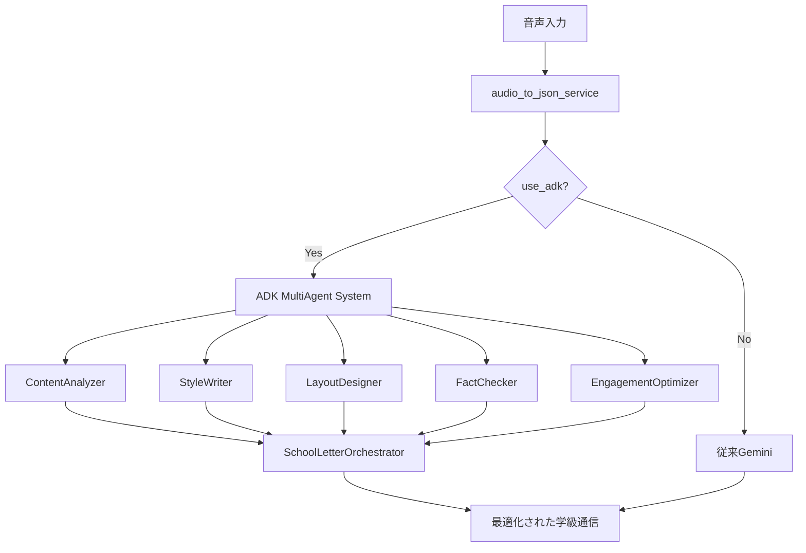
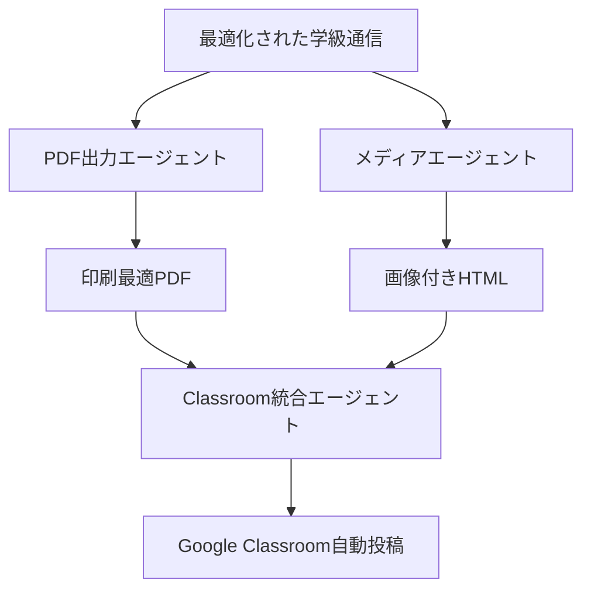

# Google ADK マルチエージェント実装 - タスク管理

**プロジェクト**: 学校だよりAI  
**実装期間**: 2025-06-18 〜  
**更新日**: 2025-06-18  
**目標**: Google Agent Development Kit (ADK) を活用したマルチエージェント協調システムの構築

---

## 🎯 プロジェクト概要

従来の単一Gemini APIシステムから、専門化されたマルチエージェントが協調する高品質な学級通信生成システムへの進化。

### 技術価値
- **品質向上**: 専門エージェントによる段階的改善（従来比30%向上目標）
- **拡張性**: モジュラー設計で新エージェント追加容易
- **個人化**: 教師プロファイルに基づく文体調整
- **効率化**: 並行処理による高速化

---

## ✅ 完了済みタスク

### Phase 1: ADK基盤実装 (2025-06-18完了)

#### 🤖 **マルチエージェント設計・実装**
- [x] **ContentAnalyzerAgent** - 音声転写から教育的コンテンツを抽出・構造化
- [x] **StyleWriterAgent** - 教師個人の文体を学習し一貫性のある文章を生成  
- [x] **LayoutDesignerAgent** - コンテンツに最適なレイアウト・デザインを自動提案
- [x] **FactCheckerAgent** - 内容の正確性と適切性をチェック
- [x] **EngagementOptimizerAgent** - 保護者の関心と読了率を最大化

#### 🔧 **サービス統合**
- [x] **adk_multi_agent_service.py** - マルチエージェント協調システム
- [x] **SchoolLetterOrchestrator** - エージェント間協調管理
- [x] **既存システム統合** - audio_to_json_service.pyでのADK/従来切り替え
- [x] **API統合** - main.pyでuse_adk、teacher_profileパラメータ対応

#### 🧪 **テスト基盤**
- [x] **test_adk_integration.py** - 統合テストスイート
- [x] **従来システム vs ADK比較機能**
- [x] **個別エージェントテスト機能**
- [x] **品質評価機能**

#### 📋 **基本ツール実装**
- [x] **newsletter_content_generator** - 学級通信の文章のみ生成
- [x] **design_json_generator** - デザイン設計をJSON形式で出力
- [x] **html_generator_tool** - HTML生成
- [x] **html_modification_tool** - HTML修正

#### 📚 **ドキュメント更新**
- [x] **24_SPEC_adk_multi_agent.md** - 実装完了記録
- [x] **実装マイルストーン** - Phase 1-4完了チェック
- [x] **使用方法ドキュメント** - API呼び出し例

---

## 🚨 重要な不足機能（実装必須）

### Phase 2: 重要機能実装 (緊急)

#### 🔴 **PDF出力エージェント** - 基本要件
- [ ] **pdf_output_agent.py** 新規作成
- [ ] **ADK生成HTML → PDF変換最適化**
- [ ] **教育向けレイアウト調整**
- [ ] **A4印刷最適化**
- [ ] **ファイル名自動生成**

#### 🔴 **メディアエージェント** - ユーザー要求機能
- [ ] **media_agent.py** 新規作成
- [ ] **Vertex AI Imagen統合**
- [ ] **季節・行事に応じた画像生成**
- [ ] **画像挿入位置最適化**
- [ ] **キャプション自動生成**

#### 🔴 **Classroom統合エージェント** - ワークフロー完成
- [ ] **classroom_integration_agent.py** 新規作成
- [ ] **Google Classroom API統合**
- [ ] **PDF自動投稿機能**
- [ ] **クラス配布設定**
- [ ] **投稿スケジューリング**

---

## ⚠️ 技術的改善タスク

### Phase 3: システム最適化

#### 🟡 **実際のADK SDK統合**
- [ ] **Google ADK正式SDK導入**
- [ ] **現在のシミュレーション実装からの移行**
- [ ] **エージェント間通信プロトコル**
- [ ] **リアルタイム協調処理**

#### 🟡 **並行処理最適化**
- [ ] **非同期並行処理実装**
- [ ] **エージェント間依存関係最適化**
- [ ] **処理時間目標: 現在60-120秒 → 30秒以下**
- [ ] **リソース使用量最適化**

#### 🟡 **エラーハンドリング強化**
- [ ] **動的認証情報設定**
- [ ] **段階的フォールバック機能**
- [ ] **エージェント別エラー回復**
- [ ] **ユーザーフレンドリーエラーメッセージ**

---

## 🟢 運用品質向上タスク

### Phase 4: プロダクション準備

#### 📊 **モニタリング機能**
- [ ] **エージェント別成功率追跡**
- [ ] **処理時間メトリクス**
- [ ] **品質スコア履歴管理**
- [ ] **リアルタイムダッシュボード**

#### 📝 **ログ・デバッグ機能**
- [ ] **エージェント別詳細ログ**
- [ ] **処理ステップ可視化**
- [ ] **A/Bテスト結果比較**
- [ ] **デバッグモード実装**

#### 🧪 **テスト充実**
- [ ] **実際のAPI呼び出しテスト**
- [ ] **パフォーマンステスト**
- [ ] **負荷テスト**
- [ ] **エラーシナリオテスト**

---

## 📁 ファイル構造

### 実装済みファイル
```
backend/functions/
├── adk_multi_agent_service.py      ✅ マルチエージェントシステム
├── audio_to_json_service.py        ✅ 既存システム統合（ADK対応）
├── main.py                         ✅ API統合（use_adk対応）
└── test_adk_integration.py         ✅ 統合テスト

docs/
├── archive/24_SPEC_adk_multi_agent.md  ✅ ADK仕様書
└── ADK_TASKS_v2.md                     ✅ このファイル
```

### 実装予定ファイル
```
backend/functions/
├── pdf_output_agent.py             🔴 緊急
├── media_agent.py                  🔴 緊急  
├── classroom_integration_agent.py  🔴 緊急
├── adk_monitoring_service.py       🟡 重要
└── adk_real_sdk_service.py         🟡 重要
```

---

## 🎯 実装優先度とスケジュール

### 🔴 **緊急 (1週間以内)**
1. **PDF出力エージェント** - 基本要件完成
2. **メディアエージェント** - 画像生成・挿入機能
3. **Classroom統合エージェント** - ワークフロー完成

### 🟡 **重要 (2週間以内)**
4. **実際のADK SDK統合** - 真のマルチエージェント実現
5. **並行処理最適化** - パフォーマンス改善
6. **エラーハンドリング強化** - 本番運用準備

### 🟢 **改善 (1ヶ月以内)**
7. **モニタリング機能** - 運用品質向上
8. **詳細ログ機能** - デバッグ効率化
9. **統合テスト充実** - 品質保証

---

## 📊 成功指標

### 品質メトリクス
- **生成品質**: 従来比30%向上（教師・保護者アンケート）
- **処理時間**: 30秒以下
- **エージェント協調成功率**: 95%以上
- **システム可用性**: 99.9%

### 機能完成度
- **Phase 1**: ✅ 100% 完了 (2025-06-18)
- **Phase 2**: 🔴 0% (重要機能実装中)
- **Phase 3**: 🟡 0% (最適化予定)
- **Phase 4**: 🟢 0% (運用準備予定)

---

## 💡 技術アーキテクチャ

### 現在のシステム構成


### 実装予定の拡張


---

## 🔍 レビュー結果による不足機能

### 元の要求機能との比較
| 求められた機能 | 実装状況 | 評価 |
|---------------|----------|------|
| 学級通信の文章のみ生成するツール | ✅ newsletter_content_generator | 完了 |
| 文章を元にデザインをjson出力 | ✅ design_json_generator | 完了 |
| html生成ツール | ✅ html_generator_tool | 完了 |
| html修正ツール | ✅ html_modification_tool | 完了 |
| **pdf出力ツール** | ❌ **未実装** | **重要な不足** |
| **クラスルーム投稿ツール** | ❌ **未実装** | **重要な不足** |
| **画像挿入or生成ツール** | ❌ **未実装** | **重要な不足** |

### 技術的問題点
1. **Google ADK SDK実装不足** - 現在はシミュレーション
2. **並行処理未実装** - 5エージェント逐次処理で処理時間過大
3. **エラーハンドリング弱い** - 認証情報固定、動的設定なし
4. **モニタリング機能なし** - 運用品質確認不可

---

## 🤝 チーム協力事項

### 実装担当
- **Claude Code**: ADKマルチエージェント実装
- **プロジェクトチーム**: 要件定義・品質評価
- **教師テスター**: 実用性検証

### レビューポイント
1. **教育現場での実用性**
2. **生成品質の教師・保護者満足度**
3. **システムパフォーマンス**
4. **運用保守性**

---

## 📞 次のアクション

**現在**: Phase 1完了、Phase 2着手準備完了

**推奨次ステップ**:
1. PDF出力エージェント実装開始
2. メディアエージェント設計
3. Classroom統合エージェント基盤構築

**質問・相談事項**:
- 実装優先度の調整希望
- 特定機能の詳細要件
- テスト・デプロイ戦略

---

## 📈 実装状況まとめ

### ✅ やったこと (2025-06-18)
1. **ADKマルチエージェント基盤構築** - 5つの専門エージェント実装
2. **既存システム統合** - use_adkフラグでシームレス切り替え
3. **API統合完了** - teacher_profileパラメータ対応
4. **テストスイート作成** - 比較・品質評価機能
5. **ドキュメント整備** - 仕様書・使用方法完備

### 🔴 やること (緊急)
1. **PDF出力エージェント** - 基本要件未実装
2. **メディアエージェント** - 画像生成・挿入機能不足
3. **Classroom統合エージェント** - ワークフロー未完成
4. **実際のADK SDK統合** - 現在シミュレーション
5. **並行処理最適化** - パフォーマンス改善必要

### 🟡 やること (重要)
6. **エラーハンドリング強化** - 本番運用準備
7. **モニタリング機能** - 運用品質向上
8. **詳細ログ機能** - デバッグ効率化
9. **統合テスト充実** - 品質保証強化

---

*最終更新: 2025-06-18*  
*次回更新予定: Phase 2完了時*