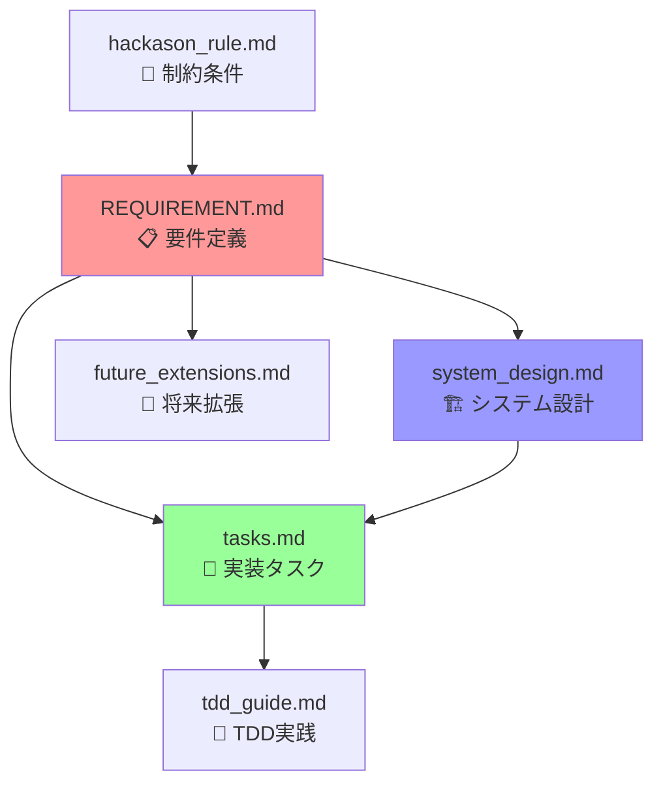

# ゆとり職員室 プロジェクトドキュメント

**HTMLベースグラレコ風学級通信作成システム - 設計・実装ドキュメント集**

*Google Cloud Japan AI Hackathon Vol.2 提出プロジェクト*

---

## 📚 ドキュメント構成

### 🎯 中核ドキュメント（必読）

| ドキュメント | 概要 | 対象者 | 更新頻度 |
|------------|------|--------|----------|
| **[REQUIREMENT.md](Archive/REQUIREMENT.md)** | プロジェクト要件定義書<br/>・14項目の機能要件<br/>・技術スタック・画面設計<br/>・成功指標・開発スケジュール | 全員 | プロジェクト初期のみ |
| **[tasks.md](Archive/tasks.md)** | 実装タスクリスト（79タスク）<br/>・Phase別詳細タスク<br/>・完了条件・優先度管理<br/>・進捗状況・TDD要件 | 開発者 | 毎日更新 |
| **[system_design.md](Archive/system_design.md)** | システム設計書<br/>・アーキテクチャ・API設計<br/>・データ設計・セキュリティ<br/>・技術選定理由 | 開発者・レビューア | 設計変更時 |

### 🔧 開発・技術ドキュメント

| ドキュメント | 概要 | 対象者 | 用途 |
|------------|------|--------|------|
| **[tdd_guide.md](tdd_guide.md)** | TDD実践ガイド<br/>・具体的なテスト例<br/>・カバレッジ目標・実践のコツ<br/>・統合テスト手法 | 開発者 | 実装時参考 |
| **[future_extensions.md](Archive/future_extensions.md)** | 将来拡張機能設計<br/>・ADKマルチエージェント<br/>・高度AI機能・実装優先度 | 開発者・企画者 | 長期計画 |
| **[hackason_rule.md](HACKASON_RULE.md)** | ハッカソン要件・制約<br/>・必須技術条件<br/>・特別賞対象・技術選定基準 | 全員 | 要件確認 |

---

## 🔄 ドキュメント関係図



---

## 📖 読み進め方

### 🎬 新規参加者向け

1. **[hackason_rule.md](HACKASON_RULE.md)** - ハッカソン制約理解
2. **[REQUIREMENT.md](Archive/REQUIREMENT.md)** - プロジェクト全体把握
3. **[system_design.md](Archive/system_design.md)** - 技術アーキテクチャ理解
4. **[tasks.md](Archive/tasks.md)** - 現在の進捗・次のタスク確認

### 💻 開発開始時

1. **[tasks.md](Archive/tasks.md)** - 今日のタスク確認
2. **[tdd_guide.md](tdd_guide.md)** - TDD手法確認
3. **[system_design.md](Archive/system_design.md)** - 実装仕様確認
4. 実装開始 → **[tasks.md](Archive/tasks.md)** 進捗更新

### 🔍 設計レビュー時

1. **[REQUIREMENT.md](Archive/REQUIREMENT.md)** - 要件適合性確認
2. **[system_design.md](Archive/system_design.md)** - 設計妥当性検証
3. **[future_extensions.md](Archive/future_extensions.md)** - 拡張性考慮
4. **[hackason_rule.md](HACKASON_RULE.md)** - 制約違反チェック

---

## 🎯 主要機能マッピング

### 音声入力→AI編集→グラレコ風HTML→PDF配信

| 機能フェーズ | 関連ドキュメント | キーポイント |
|------------|------------------|--------------|
| **音声入力** | [REQUIREMENT.md](Archive/REQUIREMENT.md) ①②<br/>[system_design.md](Archive/system_design.md) Speech-to-Text<br/>[tasks.md](Archive/tasks.md) Phase1 | ノイズ抑制・ユーザー辞書・リアルタイム字幕 |
| **AI編集** | [REQUIREMENT.md](Archive/REQUIREMENT.md) ③④⑤⑨<br/>[system_design.md](Archive/system_design.md) Gemini 1.5 Pro<br/>[tasks.md](Archive/tasks.md) Phase2 | リライト・カスタム指示・見出し生成・チャット編集 |
| **グラレコ風HTML** | [REQUIREMENT.md](Archive/REQUIREMENT.md) ⑥⑦⑧⑩<br/>[system_design.md](Archive/system_design.md) HTMLエディタ<br/>[tasks.md](Archive/tasks.md) Phase2-3 | 季節カラー・全まかせ・WYSIWYG・テンプレート |
| **PDF配信** | [REQUIREMENT.md](Archive/REQUIREMENT.md) ⑪⑫⑬<br/>[system_design.md](Archive/system_design.md) PDF生成<br/>[tasks.md](Archive/tasks.md) Phase4 | HTML↔PDF切替・Drive保存・Classroom投稿 |

---

## 📊 プロジェクト状況一覧

### 現在の進捗状況

| 項目 | 状況 | 詳細 |
|------|------|------|
| **要件定義** | ✅ 完了 | 14機能要件・非機能要件・制約すべて確定 |
| **システム設計** | ✅ 完了 | アーキテクチャ・API・データ設計完了 |
| **タスク分解** | ✅ 完了 | 79タスク・4フェーズで完全分解 |
| **開発環境** | ⏳ 準備中 | Google Cloud・Flutter・FastAPI環境構築 |
| **実装** | 🚀 開始待ち | Phase1から順次TDD実装予定 |

### 週次スケジュール

| 週 | フェーズ | 主要タスク | 成果物 |
|----|---------|------------|--------|
| **Week 1-2** | Phase 1 | 基盤構築・認証・基本API | 動作する基本システム |
| **Week 3-4** | Phase 2 | HTMLエディタ・チャット編集 | グラレコ風編集機能 |
| **Week 5** | Phase 3 | レイアウト自動生成・PDF変換 | 完全な通信作成機能 |
| **Week 6** | Phase 4 | 配信統合・最適化・テスト | ハッカソン提出版 |

### 技術要件適合状況

| カテゴリ | 要件 | 対応状況 |
|----------|------|----------|
| **Google Cloud アプリ** | Cloud Run / Cloud Storage / Cloud Functions / Firestore | ✅ 設計完了 |
| **Google Cloud AI** | Vertex AI Gemini / Speech-to-Text / Text-to-Speech | ✅ 設計完了 |
| **特別賞対象** | Flutter Web / Firebase Authentication | ✅ 設計完了 |

---

## 🔧 開発者向けクイックリンク

### 🚀 開発開始

```bash
# 1. 今日のタスク確認
open docs/tasks.md

# 2. TDD実践方法確認  
open docs/tdd_guide.md

# 3. 実装仕様確認
open docs/system_design.md
```

### 📝 日常的な更新作業

- **毎日**: [tasks.md](Archive/tasks.md) 進捗更新・完了タスクチェック
- **機能完成時**: [system_design.md](Archive/system_design.md) 実装詳細追記
- **仕様変更時**: [REQUIREMENT.md](Archive/REQUIREMENT.md) 要件更新検討

### 🎯 重要な完了条件

各タスクは以下4条件すべて満たして初めて完了：
1. **機能実装**: コードが動作し、期待される機能を提供
2. **テスト通過**: 単体テスト・統合テストが成功（TDD必須）
3. **品質確認**: コードレビュー完了・ドキュメント更新
4. **動作検証**: 実際の使用シナリオで問題なく動作

---

## 🎉 プロジェクトゴール

**「毎週2-3時間かかる学級通信作成を20分以内に短縮」**

- **音声入力** で原稿作成を高速化
- **AIチャット編集** で文章品質向上
- **グラレコ風テンプレート** で視覚的魅力向上  
- **自動配信** で配布作業を効率化

**→ 先生が子どもと向き合う「ゆとり」を創出！**

---

*最終更新: 2024年12月*
*プロジェクト全体の最新状況は [tasks.md](Archive/tasks.md) を参照* 