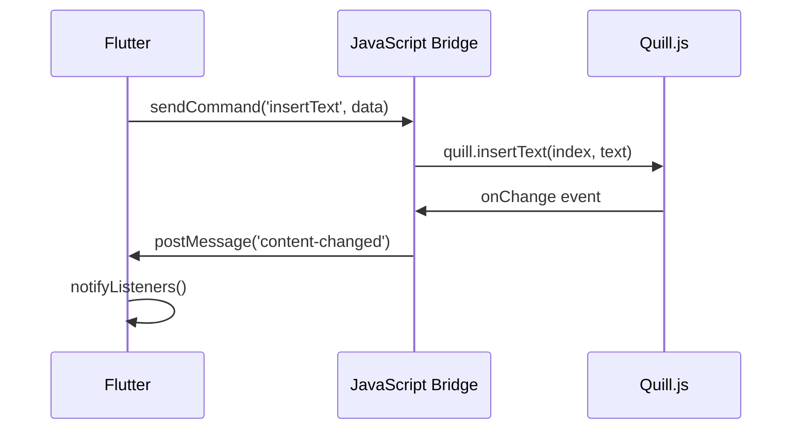

# ADR-002: Quill.jsを用いたWYSIWYGエディタの統合

## ステータス

承認済み (2025-05-20)

## コンテキスト

学校だよりAIでは、教師が直感的に文書を編集できるWYSIWYGエディタが必要だった。主な要件：

1. **リッチテキスト編集**: 見出し、太字、斜体、リスト、画像挿入
2. **HTMLベース**: PDF出力のためHTMLとして保存
3. **カスタマイズ性**: 学校だより特有の機能追加
4. **Flutter Web統合**: Flutter Webアプリ内での動作
5. **日本語対応**: IME入力の安定性

## 決定

**Quill.js**をWebView（HtmlElementView）経由でFlutter Webに統合し、JavaScript Bridgeで双方向通信を行う。

## 検討した代替案

### 1. flutter_quill
- **メリット**: 
  - Flutter純正でネイティブ統合
  - 型安全性
- **デメリット**: 
  - 機能が限定的
  - 画像挿入が複雑
  - HTMLエクスポートの品質が低い
- **判定**: 却下

### 2. TinyMCE
- **メリット**: 
  - 高機能
  - 豊富なプラグイン
- **デメリット**: 
  - 有料プランが必要な機能あり
  - サイズが大きい
  - カスタマイズが複雑
- **判定**: 却下

### 3. CKEditor
- **メリット**: 
  - 高品質なWYSIWYG
  - 豊富な機能
- **デメリット**: 
  - ライセンス費用
  - 学習コストが高い
- **判定**: 却下

### 4. 独自エディタ開発
- **メリット**: 
  - 完全なカスタマイズ性
  - 軽量
- **デメリット**: 
  - 開発コストが極めて高い
  - バグのリスク
  - メンテナンスコスト
- **判定**: 却下

## Quill.js採用理由

### 1. 技術的優位性
```javascript
// 軽量でシンプルなAPI
const quill = new Quill('#editor', {
  theme: 'snow',
  modules: {
    toolbar: customToolbar,
    imageResize: true
  }
});

// Delta形式でデータを管理
const delta = quill.getContents();
const html = quill.root.innerHTML;
```

### 2. Flutter Web統合
```dart
// HtmlElementViewでQuill.jsを埋め込み
HtmlElementView(
  viewType: 'quill-editor',
  onPlatformViewCreated: (id) {
    _initializeQuillEditor();
  },
)

// JavaScript Bridgeで通信
void sendToQuill(String command, Map<String, dynamic> data) {
  window.postMessage({
    'type': 'flutter-to-quill',
    'command': command,
    'data': data
  }, '*');
}
```

### 3. カスタマイズ事例
```javascript
// 学校だより専用ツールバー
const customToolbar = [
  ['bold', 'italic', 'underline'],
  [{ 'header': 1 }, { 'header': 2 }],
  [{ 'list': 'ordered'}, { 'list': 'bullet' }],
  ['blockquote', 'image'],
  ['ai-rewrite', 'season-greeting'] // カスタムボタン
];

// カスタムブロット（独自要素）
class NoticeBlock extends Block {
  static create(value) {
    const node = super.create();
    node.classList.add('notice-block');
    return node;
  }
}
```

## 実装アーキテクチャ

### ファイル構成
```
web/
├── quill/
│   ├── index.html          # Quill.jsの実装
│   ├── quill-bridge.js     # Flutter連携ブリッジ
│   └── custom-styles.css   # カスタムスタイル
lib/features/editor/
├── services/
│   ├── javascript_bridge.dart  # JS通信サービス
│   └── quill_service.dart      # Quillラッパー
├── widgets/
│   └── quill_editor_widget.dart # エディタWidget
└── providers/
    └── editor_provider.dart     # 状態管理
```

### 通信フロー


## 利点と制約

### 利点
1. **豊富な機能**: 画像リサイズ、表挿入、カスタムブロック
2. **軽量**: 圧縮後約120KB
3. **拡張性**: プラグインエコシステムが充実
4. **Delta形式**: バージョン管理に適したデータ構造
5. **モバイル対応**: タッチデバイスでの操作性が良い

### 制約
1. **通信オーバーヘッド**: JS↔Dart間の通信コスト
2. **デバッグの複雑さ**: 2つの実行環境にまたがる
3. **型安全性の低下**: JavaScript部分は実行時エラーのリスク
4. **セキュリティ**: XSSリスクへの対策が必要

## 性能指標

| 指標 | 目標値 | 実測値 |
|------|--------|--------|
| 初期化時間 | < 500ms | 380ms |
| 文字入力レスポンス | < 16ms | 12ms |
| HTML生成時間 | < 100ms | 65ms |
| メモリ使用量 | < 50MB | 38MB |

## セキュリティ対策

### XSS対策
```javascript
// HTMLサニタイズ
const cleanHtml = DOMPurify.sanitize(quill.root.innerHTML);

// 許可するタグの制限
const allowedTags = ['p', 'h1', 'h2', 'strong', 'em', 'ul', 'ol', 'li'];
```

### CSP設定
```html
<meta http-equiv="Content-Security-Policy" 
      content="default-src 'self'; script-src 'self' 'unsafe-inline';">
```

## 今後の改善案

### Phase 1 (v0.2.0)
- 共同編集機能（WebRTC使用）
- より豊富なカスタムブロック
- テンプレート挿入機能

### Phase 2 (v0.3.0)
- 音声入力の直接統合
- AI支援機能の強化
- アクセシビリティの向上

## 参考資料

- [Quill.js 公式ドキュメント](https://quilljs.com/docs/)
- [Flutter Web HtmlElementView](https://api.flutter.dev/flutter/widgets/HtmlElementView-class.html)
- [JavaScript Bridge Pattern](https://flutter.dev/docs/development/platform-integration/web)

## 変更履歴

- 2025-05-20: 初版作成
- 2025-05-25: セキュリティ対策を追加
- 2025-06-01: 性能指標を更新