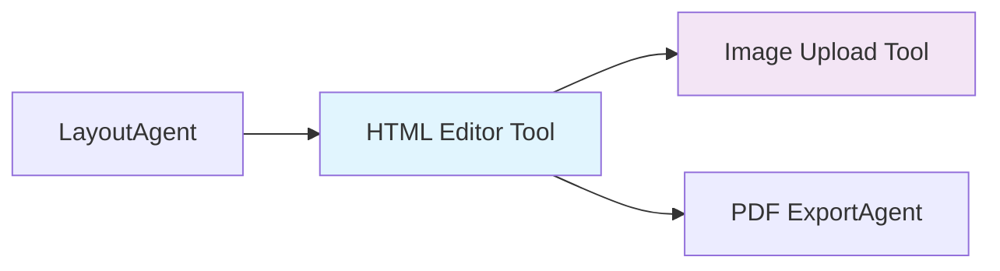
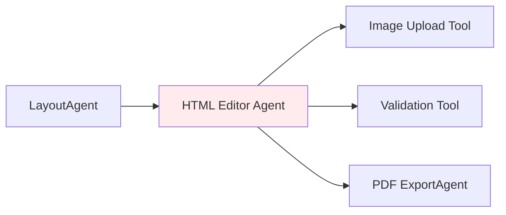

# ADR-0003: HTML エディターツール・エージェント・アーキテクチャ決定

## ステータス
承認済み

## コンテキスト

ADK（Agent Development Kit）ワークフローでは、学校だより作成のためのHTML編集機能が必要です。HTML編集を以下のどの方法で実装するかを決定する必要があります：

1. **ツール** - HTMLを受け取り、編集されたHTMLを返すシンプルな関数
2. **エージェント** - 意思決定を行い、他のツールを呼び出せる自律的なエンティティ
3. **ハイブリッド** - エージェント的な機能を持つツール

この決定は、全体的なアーキテクチャ、ユーザーエクスペリエンス、将来の拡張性に影響を与えます。

## 決定

HTMLエディターエージェントを別途作成するのではなく、**HTMLエディティングをツール（`html_editor_tool`）として実装し**、Image Upload Toolと統合することを決定しました。

## 根拠

### エージェントではなくツールを選ぶ理由

1. **単一責任**: HTML編集は基本的にUI操作であり、自律的な意思決定を必要としない
2. **シンプルな統合**: ツールは既存の LayoutAgent → PDF ExportAgent ワークフローとより簡単に統合できる
3. **パフォーマンス**: 直接的なツール呼び出しは、エージェントオーケストレーションよりも低レイテンシ
4. **ユーザー制御**: ユーザーはAI駆動の自動編集ではなく、編集を直接制御する必要がある

### アーキテクチャの利点



**エージェントアーキテクチャとの比較（却下）:**



### 具体的な利点

1. **複雑性の削減**
   - エージェントオーケストレーションロジックが不要
   - よりシンプルなエラーハンドリング
   - 直接的なデータフロー

2. **より良いユーザーエクスペリエンス**
   - より高速な応答時間
   - より予測可能な動作
   - デバッグの容易さ

3. **コスト効率**
   - より低いAPI呼び出しコスト
   - インフラストラクチャオーバーヘッドの削減
   - よりシンプルなデプロイメント

## 検討した代替案

### 選択肢1: 完全なHTMLエディターエージェント
```python
class HtmlEditorAgent:
    def __init__(self):
        self.tools = [ImageUploadTool(), ValidationTool(), PreviewTool()]
    
    async def edit_html(self, html: str) -> str:
        # Agent makes autonomous decisions about editing
        # More complex but could handle advanced scenarios
```

**メリット:**
- インテリジェントな編集提案が可能
- 将来のAI機能拡張に適している
- 関心の分離がより良い

**デメリット:**
- 現在のニーズに対してオーバーエンジニアリング
- より高いレイテンシと複雑性
- ユーザーはAI自動化ではなく制御を求める

### 選択肢2: ツール + プロンプトシステム（却下）
```python
@tool
async def html_editor_tool(html: str, editing_prompts: List[str]) -> str:
    # Use prompts to guide editing behavior
    # Hybrid approach between tool and agent
```

**メリット:**
- ツールのシンプルさを保ちながら一部の自動化が可能
- プロンプトに基づいて動作を適応させることができる

**デメリット:**
- 混乱を招くインターフェース
- 動作の予測が困難
- WYSIWYG編集には不要

### 選択肢3: マイクロエージェント（却下）
- テキスト編集、画像挿入、バリデーション用の個別エージェント
- 複数エージェント間の複雑なオーケストレーション

**メリット:**
- 最大限のモジュラリティ
- 各エージェントが単一の責任を持つ

**デメリット:**
- 巨大な複雑性のオーバーヘッド
- 貧弱なユーザーエクスペリエンス
- インタラクティブな編集に適さない

## 実装詳細

### ツールインターフェース
```python
@tool
async def html_editor_tool(
    html: str,
    editable_regions: List[str] = None,
    allowed_tags: List[str] = None,
    theme: str = "default"
) -> HtmlEditorResult:
    """
    Launch WYSIWYG HTML editor interface.
    Automatically integrates with Image Upload Tool when users insert images.
    """
```

### 統合ポイント
1. **LayoutAgentとの統合**: 編集可能領域を持つ生成されたHTMLを受け取る
2. **Image Upload Toolとの統合**: ユーザーが画像を挿入する際の自動統合
3. **PDF ExportAgentとの統合**: PDF生成のために編集されたHTMLを渡す

### 将来の拡張性
ツールアーキテクチャは将来の機能拡張を可能にします：
- AI駆動のコンテンツ提案（オプション機能として）
- 高度なバリデーションルール
- カスタム編集プラグイン
- マルチユーザー協調編集

## 結果

### ポジティブ
- **よりシンプルなコードベース**: エージェントアーキテクチャより複雑でない
- **より良いパフォーマンス**: 直接的なツール呼び出し、エージェントオーバーヘッドなし
- **テストの容易さ**: 純粋関数のユニットテスト
- **ユーザー制御**: ユーザーは編集を直接制御できる
- **明確なデータフロー**: HTML → 編集 → HTML（副作用なし）

### ネガティブ
- **限定的な自動化**: 自律的な編集決定ができない
- **将来の制限**: 複雑なAI編集が必要になった場合、リファクタリングが必要
- **ツールの結合**: Image Upload ToolはHTML Editorと密結合

### 移行パス
後でエージェント機能が必要になった場合：
1. 下位互換性のために既存のツールを保持
2. ツールをラップするHtmlEditorAgentを作成
3. ユースケースに基づく段階的な移行

## 監視と成功指標

### パフォーマンス指標
- エディター起動のツール応答時間 < 100ms
- 画像アップロード統合 < 500ms/画像
- ユーザー満足度スコア > 4.0/5.0

### アーキテクチャ指標
- コード複雑度（循環的複雑度 < 10）
- テストカバレッジ > 90%
- 統合失敗率 < 1%

## 関連する決定

- [ADR-0001: Agent Development Kit Adoption](adr-0001-adk-adoption.md)
- [ADR-0002: Firebase Storage for Images](adr-0002-firebase-storage.md)

## 参考文献

- [Google ADK Documentation](https://developers.google.com/adk)
- [Agent vs Tool Design Patterns](https://cloud.google.com/blog/topics/ai/agent-design-patterns)
- [HTML Editor Tool Implementation](../reference/tools/html_editor_tool.md)
- [ADK Workflow Guide](../guides/adk-workflow.md)

---

**決定日**: 2024-06-20  
**決定者**: アーキテクチャチーム  
**レビュー日**: 2024-09-20（3ヶ月後）