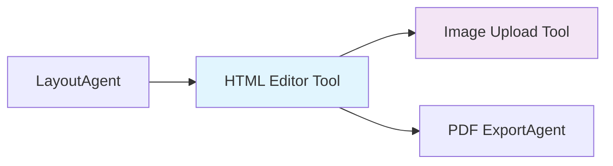
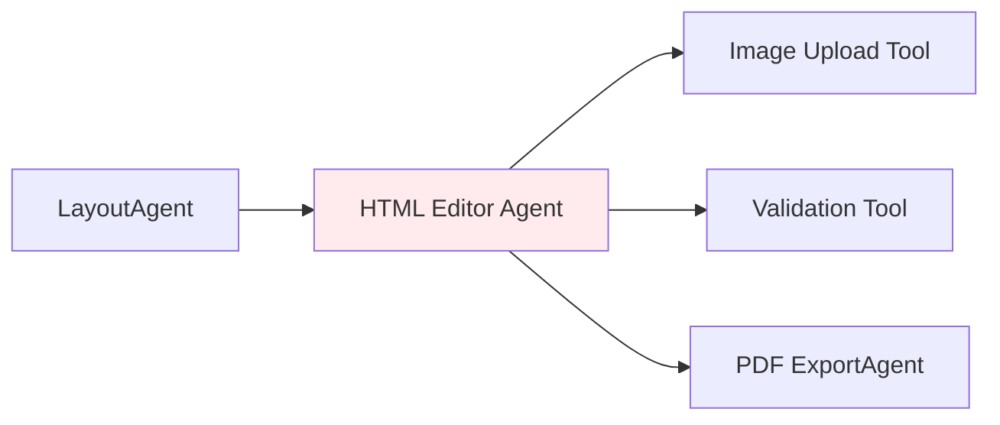

# ADR-0003: HTML エディターツール・エージェント・アーキテクチャ決定

## ステータス
承認済み

## コンテキスト

ADK（Agent Development Kit）ワークフローでは、学校だより作成のためのHTML編集機能が必要です。HTML編集を以下のどの方法で実装するかを決定する必要があります：

1. **ツール** - HTMLを受け取り、編集されたHTMLを返すシンプルな関数
2. **エージェント** - 意思決定を行い、他のツールを呼び出せる自律的なエンティティ
3. **ハイブリッド** - エージェント的な機能を持つツール

この決定は、全体的なアーキテクチャ、ユーザーエクスペリエンス、将来の拡張性に影響を与えます。

## 決定

HTMLエディターエージェントを別途作成するのではなく、**HTMLエディティングをツール（`html_editor_tool`）として実装し**、Image Upload Toolと統合することを決定しました。

## 根拠

### エージェントではなくツールを選ぶ理由

1. **単一責任**: HTML編集は基本的にUI操作であり、自律的な意思決定を必要としない
2. **シンプルな統合**: ツールは既存の LayoutAgent → PDF ExportAgent ワークフローとより簡単に統合できる
3. **パフォーマンス**: 直接的なツール呼び出しは、エージェントオーケストレーションよりも低レイテンシ
4. **ユーザー制御**: ユーザーはAI駆動の自動編集ではなく、編集を直接制御する必要がある

### Architecture Benefits



**Vs. Agent Architecture (rejected):**



### Specific Advantages

1. **Reduced Complexity**
   - No need for agent orchestration logic
   - Simpler error handling
   - Direct data flow

2. **Better User Experience**
   - Faster response times
   - More predictable behavior
   - Easier debugging

3. **Cost Efficiency**
   - Lower API call costs
   - Reduced infrastructure overhead
   - Simpler deployment

## Alternatives Considered

### Option 1: Full HTML Editor Agent
```python
class HtmlEditorAgent:
    def __init__(self):
        self.tools = [ImageUploadTool(), ValidationTool(), PreviewTool()]
    
    async def edit_html(self, html: str) -> str:
        # Agent makes autonomous decisions about editing
        # More complex but could handle advanced scenarios
```

**Pros:**
- Could make intelligent editing suggestions
- Extensible for future AI-powered features
- Better separation of concerns

**Cons:**
- Over-engineered for current needs
- Higher latency and complexity
- Users want control, not AI automation

### Option 2: Tool + Prompt System (Rejected)
```python
@tool
async def html_editor_tool(html: str, editing_prompts: List[str]) -> str:
    # Use prompts to guide editing behavior
    # Hybrid approach between tool and agent
```

**Pros:**
- Some automation while keeping tool simplicity
- Could adapt behavior based on prompts

**Cons:**
- Confusing interface
- Hard to predict behavior
- Not needed for WYSIWYG editing

### Option 3: Micro-Agents (Rejected)
- Separate agents for text editing, image insertion, validation
- Complex orchestration between multiple agents

**Pros:**
- Maximum modularity
- Each agent has single responsibility

**Cons:**
- Massive complexity overhead
- Poor user experience
- Not suitable for interactive editing

## Implementation Details

### Tool Interface
```python
@tool
async def html_editor_tool(
    html: str,
    editable_regions: List[str] = None,
    allowed_tags: List[str] = None,
    theme: str = "default"
) -> HtmlEditorResult:
    """
    Launch WYSIWYG HTML editor interface.
    Automatically integrates with Image Upload Tool when users insert images.
    """
```

### Integration Points
1. **With LayoutAgent**: Receives generated HTML with editable regions
2. **With Image Upload Tool**: Automatic integration when user inserts images
3. **With PDF ExportAgent**: Passes edited HTML for PDF generation

### Future Extensibility
The tool architecture allows for future enhancements:
- AI-powered content suggestions (as optional features)
- Advanced validation rules
- Custom editing plugins
- Multi-user collaborative editing

## Consequences

### Positive
- **Simpler codebase**: Less complex than agent architecture
- **Better performance**: Direct tool calls, no agent overhead
- **Easier testing**: Unit tests for pure functions
- **User control**: Users have direct control over editing
- **Clear data flow**: HTML → Edit → HTML (no side effects)

### Negative
- **Limited automation**: Cannot make autonomous editing decisions
- **Future limitations**: If we need complex AI editing, would need refactoring
- **Tool coupling**: Image Upload Tool is tightly coupled with HTML Editor

### Migration Path
If we later need agent capabilities:
1. Keep existing tool for backward compatibility
2. Create HtmlEditorAgent that wraps the tool
3. Gradual migration based on use cases

## Monitoring and Success Metrics

### Performance Metrics
- Tool response time < 100ms for editor launch
- Image upload integration < 500ms per image
- User satisfaction score > 4.0/5.0

### Architecture Metrics
- Code complexity (cyclomatic complexity < 10)
- Test coverage > 90%
- Integration failure rate < 1%

## Related Decisions

- [ADR-0001: Agent Development Kit Adoption](adr-0001-adk-adoption.md)
- [ADR-0002: Firebase Storage for Images](adr-0002-firebase-storage.md)

## References

- [Google ADK Documentation](https://developers.google.com/adk)
- [Agent vs Tool Design Patterns](https://cloud.google.com/blog/topics/ai/agent-design-patterns)
- [HTML Editor Tool Implementation](../reference/tools/html_editor_tool.md)
- [ADK Workflow Guide](../guides/adk-workflow.md)

---

**Decision Date**: 2024-06-20  
**Decision Makers**: Architecture Team  
**Review Date**: 2024-09-20 (3 months)