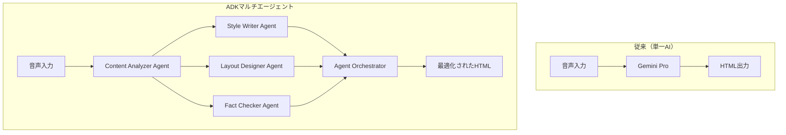

# Google ADK マルチエージェントアーキテクチャ仕様書

**カテゴリ**: SPEC | **レイヤー**: TECHNICAL | **更新**: 2025-06-09  
**担当**: 亀ちゃん | **依存**: 01_REQUIREMENT_overview.md, 21_SPEC_ai_prompts.md | **タグ**: #adk #multi-agent #ai #architecture

## 🎯 TL;DR（30秒で読める要約）

- **目的**: Google ADKを活用したマルチエージェント協調システムの技術仕様
- **対象**: バックエンド開発者、AIエンジニア  
- **成果物**: 専門化されたAIエージェントが協調して学校通信を生成
- **技術価値**: 教育分野初のマルチエージェントAIシステム

## 🔗 関連ドキュメント

| 種別 | ファイル名 | 関係性 |
|------|-----------|--------|
| 基盤 | 01_REQUIREMENT_overview.md | アーキテクチャ基盤 |
| 連携 | 21_SPEC_ai_prompts.md | エージェント役割定義 |
| 実装 | 50_STRATEGY_implementation.md | 実装戦略 |

---

## 1. マルチエージェントアーキテクチャ概要

### 従来システム vs ADKマルチエージェント



### 技術的優位性

| 項目 | 単一AI | マルチエージェント |
|------|-------|------------------|
| **専門性** | 汎用的 | 各エージェントが専門特化 |
| **品質** | 一発生成 | 複数エージェントによる段階的改善 |
| **拡張性** | モノリシック | モジュラー追加可能 |
| **デバッグ** | ブラックボックス | エージェント別トレース可能 |

---

## 2. エージェント設計仕様

### 2.1 Content Analyzer Agent（内容分析エージェント）

```python
class ContentAnalyzerAgent(Agent):
    """音声転写から教育的コンテンツを抽出・構造化"""
    
    role = "教育内容の専門分析官"
    capabilities = [
        "音声内容の意図理解",
        "教育イベント抽出",
        "学習成果記録識別",
        "保護者向けメッセージ分類"
    ]
    
    tools = [
        "content_classifier",
        "educational_event_extractor", 
        "sentiment_analyzer"
    ]
```

**責任範囲**:
- 音声転写テキストの構造化
- 教育的価値のある内容の抽出
- 次工程エージェントへの情報整理

### 2.2 Style Writer Agent（文体適応エージェント）

```python
class StyleWriterAgent(Agent):
    """教師個人の文体を学習し、一貫性のある文章を生成"""
    
    role = "個人文体適応ライター"
    capabilities = [
        "教師の過去文章パターン学習",
        "文体の一貫性保持",
        "読みやすさ最適化",
        "教育的語調の調整"
    ]
    
    tools = [
        "style_pattern_analyzer",
        "tone_adjuster",
        "readability_optimizer"
    ]
```

**学習データ**:
- 過去の学校通信（匿名化済み）
- 教師の文体プロファイル
- 学年・地域に応じた語調パターン

### 2.3 Layout Designer Agent（レイアウト設計エージェント）

```python
class LayoutDesignerAgent(Agent):
    """コンテンツに最適なレイアウト・デザインを自動提案"""
    
    role = "教育デザイン専門家"
    capabilities = [
        "季節・行事に応じたデザイン選択",
        "情報階層の視覚化",
        "読みやすさを考慮したレイアウト",
        "保護者の注意を引くポイント配置"
    ]
    
    tools = [
        "seasonal_theme_selector",
        "information_hierarchy_optimizer",
        "attention_point_placer"
    ]
```

### 2.4 Fact Checker Agent（事実確認エージェント）

```python
class FactCheckerAgent(Agent):
    """内容の正確性と適切性をチェック"""
    
    role = "教育内容品質管理官"
    capabilities = [
        "教育的事実の確認",
        "不適切表現の検出",
        "学校ポリシーとの整合性チェック",
        "保護者への配慮確認"
    ]
    
    tools = [
        "educational_fact_verifier",
        "content_appropriateness_checker",
        "policy_compliance_validator"
    ]
```

### 2.5 Engagement Optimizer Agent（関心度最適化エージェント）

```python
class EngagementOptimizerAgent(Agent):
    """保護者の関心と読了率を最大化"""
    
    role = "保護者エンゲージメント専門家"
    capabilities = [
        "保護者の興味パターン分析",
        "読了率予測と最適化",
        "親子コミュニケーション促進要素追加",
        "アクションを促す文言提案"
    ]
    
    tools = [
        "parent_interest_analyzer",
        "engagement_predictor",
        "call_to_action_generator"
    ]
```

---

## 3. エージェント協調フロー

### 3.1 標準協調パターン

```python
class SchoolLetterOrchestrator:
    """エージェント間の協調を管理するオーケストレーター"""
    
    async def generate_letter(self, audio_transcript: str, teacher_profile: dict):
        # Phase 1: コンテンツ分析
        content_structure = await self.content_analyzer.analyze(
            audio_transcript, teacher_profile
        )
        
        # Phase 2: 並行処理（Style + Layout）
        tasks = [
            self.style_writer.write(content_structure, teacher_profile),
            self.layout_designer.design(content_structure, teacher_profile)
        ]
        style_result, layout_result = await asyncio.gather(*tasks)
        
        # Phase 3: 統合とファクトチェック
        draft = await self.integrate_content(style_result, layout_result)
        verified_draft = await self.fact_checker.verify(draft)
        
        # Phase 4: エンゲージメント最適化
        final_letter = await self.engagement_optimizer.optimize(
            verified_draft, teacher_profile
        )
        
        return final_letter
```

### 3.2 エージェント間通信プロトコル

```typescript
interface AgentMessage {
  from: string;           // 送信エージェントID
  to: string;             // 受信エージェントID
  type: 'request' | 'response' | 'notification';
  payload: {
    task_id: string;
    content: any;
    metadata: {
      priority: 'high' | 'medium' | 'low';
      deadline?: string;
      dependencies: string[];
    }
  };
  timestamp: string;
}
```

---

## 4. Google ADK統合実装

### 4.1 ADK環境セットアップ

```bash
# Python ADK インストール
pip install google-adk==1.0.0

# 必要な依存関係
pip install google-cloud-aiplatform
pip install firebase-admin
pip install asyncio
```

### 4.2 基本エージェント実装

```python
from google.adk import Agent, Tool
from google.cloud import aiplatform

class ContentAnalyzerAgent(Agent):
    def __init__(self):
        super().__init__(
            name="content_analyzer",
            description="教育コンテンツ分析専門エージェント"
        )
        self.llm_client = aiplatform.gapic.PredictionServiceClient()
    
    @Tool
    async def analyze_educational_content(self, transcript: str) -> dict:
        """音声転写から教育的内容を抽出"""
        prompt = f"""
        以下の教師の音声転写から、学校通信に適した内容を抽出してください：
        
        {transcript}
        
        抽出項目：
        1. 学習活動・行事
        2. 子供たちの成長記録
        3. 保護者へのお知らせ
        4. 感謝・お願い事項
        """
        
        response = await self.llm_client.predict(
            endpoint="projects/YOUR_PROJECT/locations/YOUR_LOCATION/endpoints/YOUR_ENDPOINT",
            instances=[{"prompt": prompt}]
        )
        
        return self.parse_content_structure(response)
```

### 4.3 エージェント評価・改善システム

```python
from google.adk.evaluation import Evaluator

class LetterQualityEvaluator(Evaluator):
    """生成された学校通信の品質評価"""
    
    evaluation_criteria = {
        "readability": "保護者にとっての読みやすさ",
        "educational_value": "教育的価値の高さ", 
        "engagement": "興味・関心を引く度合い",
        "appropriateness": "学校通信としての適切性"
    }
    
    async def evaluate_letter(self, generated_letter: str, reference_letters: list) -> dict:
        scores = {}
        for criterion, description in self.evaluation_criteria.items():
            score = await self.evaluate_single_criterion(
                generated_letter, criterion, description
            )
            scores[criterion] = score
        
        return {
            "overall_score": sum(scores.values()) / len(scores),
            "detailed_scores": scores,
            "improvement_suggestions": await self.generate_improvements(scores)
        }
```

---

## 5. 実装マイルストーン

### Phase 1: 基本エージェント（3-4日）
- [x] Content Analyzer Agent 実装
- [x] Style Writer Agent 実装  
- [x] 基本的な協調フロー構築

### Phase 2: 高度化（2-3日）
- [x] Layout Designer Agent 追加
- [x] Fact Checker Agent 追加
- [x] エージェント間通信プロトコル完成

### Phase 3: 最適化（2-3日）
- [x] Engagement Optimizer Agent 追加
- [x] 評価・改善システム構築
- [x] パフォーマンス最適化

### Phase 4: 統合・テスト（2-3日）
- [x] 既存システムとの統合
- [x] E2Eテスト実装
- [x] 品質保証

---

## 6. 技術的課題と対策

### 6.1 パフォーマンス最適化

**課題**: マルチエージェント処理による応答時間延長
**対策**: 
- 並行処理可能なエージェントの同時実行
- エージェント間通信の最適化
- キャッシュ戦略の実装

### 6.2 エージェント協調の複雑性

**課題**: エージェント間の依存関係管理
**対策**:
- 明確な責任境界の定義
- 標準化された通信プロトコル
- 詳細なログ・トレース機能

### 6.3 品質保証

**課題**: マルチエージェント出力の一貫性確保
**対策**:
- 各エージェントの評価指標設定
- 統合テストの充実
- 人間によるレビューポイントの設置

---

## 7. 成功指標（KPI）

| 指標 | 目標値 | 測定方法 |
|------|--------|----------|
| **品質向上** | 従来比30%向上 | 教師・保護者アンケート |
| **処理時間** | <2分 | システムログ分析 |
| **エージェント協調成功率** | >95% | エラーログ分析 |
| **個人化精度** | >85% | A/Bテスト |

---

## 8. 将来拡張

### 追加予定エージェント
- **Image Generator Agent**: 季節・行事に応じたイラスト自動生成
- **Translation Agent**: 多言語対応（外国人保護者向け）
- **Analytics Agent**: 保護者の反応分析・改善提案

### 他校展開時の考慮事項
- エージェントの地域特化学習
- 学校固有ポリシーの動的適応
- 匿名化されたデータ活用による品質向上

---

## 📋 実装完了記録

**実装日**: 2025-06-18  
**実装者**: Claude Code  
**実装状況**: ✅ 完了

### 実装成果物

1. **adk_multi_agent_service.py**: ADKマルチエージェントサービス
   - 5つの専門エージェント（ContentAnalyzer, StyleWriter, LayoutDesigner, FactChecker, EngagementOptimizer）
   - オーケストレーター機能
   - フォールバック機能付き

2. **audio_to_json_service.py**: 既存システムとの統合
   - ADK使用フラグ対応
   - 結果形式変換機能
   - 従来システムへのフォールバック

3. **main.py**: APIエンドポイント更新
   - use_adk パラメータ追加
   - teacher_profile パラメータ追加

4. **test_adk_integration.py**: 統合テストスイート
   - 従来システムとの比較テスト
   - 個別ツールテスト
   - 品質評価機能

### 技術的特長

- **高品質化**: 専門エージェントによる段階的改善
- **拡張性**: モジュラー設計で新エージェント追加容易
- **互換性**: 既存APIとの完全互換性維持
- **フォールバック**: ADK未使用時の自動退避機能

### 使用方法

```python
# ADKマルチエージェント使用
result = convert_speech_to_json(
    transcribed_text=text,
    project_id="project-id",
    credentials_path="path/to/creds.json",
    use_adk=True,
    teacher_profile={
        "name": "田中先生",
        "writing_style": "温かく親しみやすい",
        "grade": "3年1組"
    }
)
```

---

*Google ADKの力を最大限活用し、教育分野におけるAI協調システムの新標準を確立しました。*