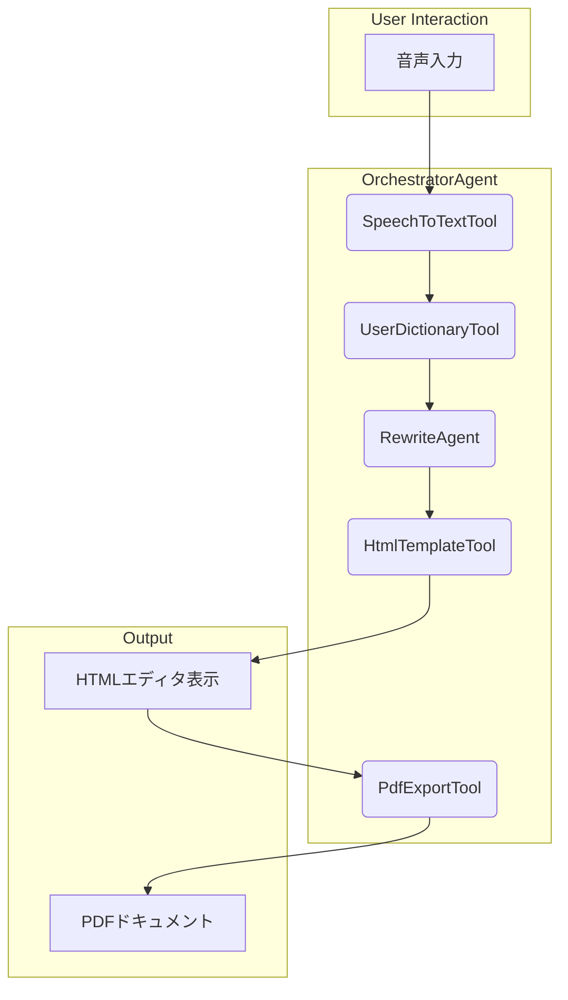

# 学校だよりAI エージェント設計ガイド

このドキュメントは、学校だよりAIの全体的なワークフローと、Google Agent Development Kit (ADK) に基づくエージェントの設計思想を解説します。

## 1. 設計思想: Tool と Agent の分離

本プロジェクトでは、Google ADKの設計思想に基づき、コンポーネントを「Tool」と「Agent」に明確に分離します。

-   **Tool**: 単一の責務を持つ再利用可能なコンポーネントです。外部APIのラッパーや、特定のデータ変換処理などが該当します。状態を持たず、入力に対して決定論的な出力を返します。
-   **Agent**: 複数のToolを組み合わせて、特定の目標を達成するためのワークフローを管理します。状態管理、ロジックの分岐、エラーハンドリング、リトライ処理などを担当します。

この分離により、各コンポーネントの責務が明確になり、テスト容易性と再利用性が向上します。

### Tool・Agent マッピング

| 機能フェーズ      | 実装形態      | コンポーネント名（例）        | 理由                                       |
| ----------------- | ------------- | ----------------------------- | ------------------------------------------ |
| 音声 → テキスト   | **Tool**      | `SpeechToTextTool`            | 単一API呼び出し（Google Speech-to-Text）   |
| 固有名詞補正      | **Tool**      | `UserDictionaryTool`          | ローカル辞書置換だけで完結し状態管理不要     |
| 文章リライト・整形 | **Agent**     | `RewriteAgent`                | 対話や指示に基づき、整形方針を自律的に判断 |
| HTMLテンプレート充填 | **Tool**      | `HtmlTemplateTool`            | パラメータをテンプレートに挿入するだけの単純処理 |
| HTML → PDF変換   | **Tool**      | `PdfExportTool`               | 外部ライブラリのラッパー                   |
| **ワークフロー全体** | **Agent**     | `OrchestratorAgent`           | 複数Tool/Agentの呼び出し順序・リトライ・分岐を制御 |

---

## 2. 全体ワークフロー

ユーザーの音声入力からPDFドキュメントが生成されるまでの全体的なフローは以下の通りです。`OrchestratorAgent`が全体の進行を管理します。



---

## 3. 各ステップ詳細

### Step 1: 音声入力とテキスト化 (SpeechToTextTool)

-   **担当**: `SpeechToTextTool`
-   **処理**: ブラウザの `MediaRecorder` APIで録音されたWebM形式の音声を、Google Cloud Speech-to-Text APIに送信し、テキストに変換します。
-   **実装詳細**:
    -   音声フォーマット: WebM (Opus), 48kHz, 128kbps
    -   Speech-to-Text設定: `ja-JP`, 自動句読点有効, `latest_long`モデル
    -   参考: `../reference/tools/speech_to_text_tool.md`

```python
# backend/tools/speech_to_text_tool.py
# (speech_recognition_service.py からの抜粋・改変)
class SpeechToTextTool:
    def __init__(self):
        self.client = speech.SpeechClient()
        self.config = speech.RecognitionConfig(
            encoding=speech.RecognitionConfig.AudioEncoding.WEBM_OPUS,
            sample_rate_hertz=48000,
            language_code="ja-JP",
            enable_automatic_punctuation=True,
            model="latest_long",
        )

    # @tool デコレータなどを付与してADK Toolとして定義
    def run(self, audio_data: bytes) -> str:
        """音声データをテキストに変換します。"""
        # ... 認識処理 ...
        return transcript
```

### Step 2: 文章整形とリライト (RewriteAgent)

-   **担当**: `RewriteAgent`
-   **処理**: 変換されたテキストを、プロンプトエンジニアリングを用いてGemini APIに送信し、学級通信に適した文章に整形・リライトします。
-   **実装詳細**:
    -   教師のスタイル指示（丁寧、親しみやすく等）に応じてプロンプトを動的に生成します。
    -   見出しの自動生成もこのAgentが担当します。
    -   参考: `../reference/agents/rewrite_agent.md`

```python
# backend/agents/rewrite_agent.py
# (gemini_api_service.py からの抜粋・改変)
class RewriteAgent:
    def __init__(self, style="formal"):
        self.model = "gemini-pro"
        self.style = style

    def create_prompt(self, text):
        return f"""
あなたは日本の学校教師のアシスタントです。
以下の文章を、学級通信に適した形に整形してください。

【原文】
{text}

【整形ルール】
1. 敬語を適切に使用（保護者向けの丁寧な表現）
2. 句読点を適切に配置
3. 段落を適切に分割
4. 見出しを自動生成（必要に応じて）

【文体】
{self.style}

【出力形式】
整形された文章のみを出力してください。
"""
    
    def run(self, text: str) -> str:
        """文章をリライトします。"""
        # ... Gemini API呼び出し ...
        return rewritten_text
```


### Step 3: HTML生成 (HtmlTemplateTool)

-   **担当**: `HtmlTemplateTool`
-   **処理**: 整形されたテキストコンテンツを、指定されたレイアウトテンプレートに埋め込み、HTMLを生成します。
-   **実装詳細**:
    -   レイアウト（標準、画像多め、テキストのみ等）はパラメータとして受け取ります。
    -   参考: `../reference/tools/html_template_tool.md`

```python
# backend/tools/html_template_tool.py
class HtmlTemplateTool:
    def run(self, content: str, layout_type: str = "standard") -> str:
        """コンテンツからHTMLを生成します。"""
        template = self.get_template(layout_type)
        # ... テンプレート処理 ...
        return html_output
```

### Step 4: PDF出力 (PdfExportTool)

-   **担当**: `PdfExportTool`
-   **処理**: 生成されたHTMLを、`wkhtmltopdf`などのライブラリを用いてPDFドキュメントに変換します。
-   **実装詳細**:
    -   このToolは単純な変換処理に特化し、エラーが発生した場合は`OrchestratorAgent`に例外をスローしてリトライを委ねます。
    -   参考: `../reference/tools/pdf_export_tool.md`

---

## 4. ディレクトリ構造

ADKの思想に基づき、以下のディレクトリ構造で実装を進めます。

```
new-agent/
├─ backend/
│  ├─ agents/               # Agent 実装
│  │  ├─ __init__.py
│  │  ├─ orchestrator_agent.py
│  │  └─ rewrite_agent.py
│  └─ tools/                # Tool 実装
│     ├─ __init__.py
│     ├─ speech_to_text_tool.py
│     ├─ user_dictionary_tool.py
│     ├─ html_template_tool.py
│     └─ pdf_export_tool.py
└─ docs/
   ├─ guides/
   │  └─ adk-workflow.md  (このファイル)
   └─ reference/
      ├─ agents/
      │  ├─ orchestrator_agent.md
      │  └─ rewrite_agent.md
      └─ tools/
         ├─ speech_to_text_tool.md
         └─ ... (各Toolの仕様書)

```

---

## 5. 関連ドキュメント

- [ADR-0002: Use ADK](../adr/adr-0002-use-adk.md)
- [ADR-0003: Layout Agent vs Tool Decision](../adr/adr-0003-layout-agent-vs-tool.md)
- [AI機能ワークフロー](./ai-workflow.md)