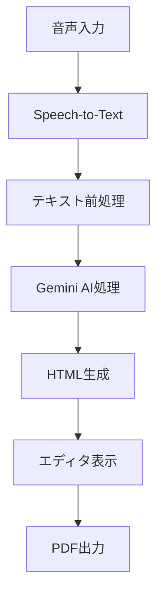

# AI機能ワークフロー

学校だよりAIの中核となるAI処理フローについて解説します。音声入力から最終的なドキュメント生成まで、各ステップの詳細と実装方法を説明します。

## 🎯 全体フロー



## 🎤 Step 1: 音声入力

### 実装詳細

音声入力はブラウザのMediaRecorder APIを使用して実装されています。

```dart
// lib/core/services/audio_service.dart
class AudioService {
  Future<void> startRecording() async {
    // ブラウザのマイク権限を取得
    final stream = await window.navigator.mediaDevices.getUserMedia({
      'audio': true,
      'video': false,
    });
    
    // MediaRecorderの初期化
    _recorder = MediaRecorder(stream, {
      'mimeType': 'audio/webm',
      'audioBitsPerSecond': 128000,
    });
    
    // 録音開始
    _recorder.start();
  }
}
```

### 音声フォーマット
- **形式**: WebM (Opus codec)
- **サンプリングレート**: 48kHz
- **ビットレート**: 128kbps
- **最大録音時間**: 5分

### エラーハンドリング
- マイク権限拒否時の処理
- ブラウザ非対応時のフォールバック
- 録音エラー時の自動リトライ

## 🔤 Step 2: Speech-to-Text変換

### Google Cloud Speech-to-Text設定

```python
# backend/functions/speech_recognition_service.py
class SpeechRecognitionService:
    def __init__(self):
        self.client = speech.SpeechClient()
        self.config = speech.RecognitionConfig(
            encoding=speech.RecognitionConfig.AudioEncoding.WEBM_OPUS,
            sample_rate_hertz=48000,
            language_code="ja-JP",
            enable_automatic_punctuation=True,
            model="latest_long",
            use_enhanced=True,
        )
```

### 音声認識の最適化

#### ユーザー辞書の活用
```python
# 学校特有の用語を辞書に追加
speech_context = speech.SpeechContext(
    phrases=[
        "学級通信",
        "保護者各位",
        "運動会",
        "修学旅行",
        # ユーザーが登録した単語
        *user_dictionary_words
    ],
    boost=20.0  # 重要度を高く設定
)
```

#### リアルタイム認識
```python
async def recognize_streaming(audio_stream):
    """ストリーミング音声認識"""
    streaming_config = speech.StreamingRecognitionConfig(
        config=self.config,
        interim_results=True,  # 途中結果を返す
    )
    
    # ストリーミング認識の実行
    responses = client.streaming_recognize(
        streaming_config,
        audio_stream
    )
    
    for response in responses:
        for result in response.results:
            yield {
                'transcript': result.alternatives[0].transcript,
                'is_final': result.is_final,
                'confidence': result.alternatives[0].confidence
            }
```

## 🤖 Step 3: Gemini AIによる文章整形

### プロンプトエンジニアリング

```python
# backend/functions/gemini_api_service.py
class GeminiAPIService:
    def create_rewrite_prompt(self, text, style="formal"):
        """リライト用プロンプトの生成"""
        prompt = f"""
あなたは日本の学校教師のアシスタントです。
以下の文章を、学級通信に適した形に整形してください。

【原文】
{text}

【整形ルール】
1. 敬語を適切に使用（保護者向けの丁寧な表現）
2. 句読点を適切に配置
3. 段落を適切に分割
4. 見出しを自動生成（必要に応じて）
5. 教育的な配慮を持った表現に調整

【文体】
{self.get_style_instruction(style)}

【出力形式】
整形された文章のみを出力してください。
"""
        return prompt
```

### スタイルバリエーション

```python
WRITING_STYLES = {
    "formal": "丁寧で格式のある文体",
    "friendly": "親しみやすく温かみのある文体",
    "informative": "情報を分かりやすく伝える文体",
    "seasonal": "季節感を取り入れた文体"
}
```

### AI処理の最適化

#### トークン管理
```python
def optimize_prompt_tokens(self, text, max_tokens=2000):
    """プロンプトのトークン数を最適化"""
    # テキストが長い場合は要約してから処理
    if self.count_tokens(text) > max_tokens:
        summary = self.summarize_text(text)
        return self.create_rewrite_prompt(summary)
    return self.create_rewrite_prompt(text)
```

#### レスポンスストリーミング
```python
async def generate_content_stream(self, prompt):
    """ストリーミングでコンテンツ生成"""
    response = await self.model.generate_content_async(
        prompt,
        stream=True,
        generation_config={
            "temperature": 0.7,
            "top_p": 0.95,
            "max_output_tokens": 2048,
        }
    )
    
    async for chunk in response:
        yield chunk.text
```

## 🎨 Step 4: 見出し自動生成

### 見出し生成ロジック

```python
def generate_headings(self, content):
    """コンテンツから適切な見出しを生成"""
    prompt = f"""
以下の文章から適切な見出しを3-5個生成してください。

【文章】
{content}

【見出しの条件】
- 10文字以内
- 内容を的確に表現
- 読者の興味を引く
- 学級通信にふさわしい

【出力形式】
見出し1: [見出し]
見出し2: [見出し]
...
"""
    
    response = self.model.generate_content(prompt)
    return self.parse_headings(response.text)
```

### 見出しの種類

1. **イベント型**: 「運動会のお知らせ」「修学旅行レポート」
2. **連絡型**: 「来週の予定」「持ち物のお願い」
3. **報告型**: 「学習の様子」「クラスの成長」
4. **季節型**: 「春の訪れ」「夏休みに向けて」

## 📝 Step 5: HTMLテンプレート生成

### レイアウトシステム

```python
class LayoutGenerator:
    def generate_html(self, content, layout_type="standard"):
        """コンテンツからHTMLを生成"""
        template = self.get_template(layout_type)
        
        # セクション分割
        sections = self.split_into_sections(content)
        
        # HTML生成
        html_parts = []
        for section in sections:
            html_parts.append(
                self.render_section(section, template)
            )
        
        return self.wrap_in_layout(html_parts, template)
```

### テンプレート種類

```python
LAYOUT_TEMPLATES = {
    "standard": {
        "columns": 1,
        "image_position": "inline",
        "font_size": "medium"
    },
    "image_heavy": {
        "columns": 2,
        "image_position": "grid",
        "font_size": "small"
    },
    "text_only": {
        "columns": 1,
        "image_position": "none",
        "font_size": "large"
    },
    "magazine": {
        "columns": 2,
        "image_position": "mixed",
        "font_size": "medium"
    }
}
```

## 🔄 Step 6: エラーハンドリングとリトライ

### 堅牢なエラー処理

```python
class AIWorkflowOrchestrator:
    async def process_with_retry(self, audio_data, max_retries=3):
        """リトライ機能付き処理"""
        for attempt in range(max_retries):
            try:
                # 音声認識
                text = await self.speech_to_text(audio_data)
                
                # AI処理
                refined_text = await self.refine_with_ai(text)
                
                # HTML生成
                html = await self.generate_html(refined_text)
                
                return {
                    "success": True,
                    "data": {
                        "original_text": text,
                        "refined_text": refined_text,
                        "html": html
                    }
                }
                
            except Exception as e:
                if attempt == max_retries - 1:
                    return {
                        "success": False,
                        "error": str(e),
                        "fallback": self.get_fallback_response()
                    }
                
                # 指数バックオフでリトライ
                await asyncio.sleep(2 ** attempt)
```

## 📊 パフォーマンス最適化

### 処理時間の目標

| 処理 | 目標時間 | 現在の実績 |
|------|----------|------------|
| 音声認識（30秒） | < 2秒 | 1.5秒 |
| AI整形 | < 3秒 | 2.8秒 |
| HTML生成 | < 1秒 | 0.5秒 |
| 全体 | < 6秒 | 4.8秒 |

### キャッシング戦略

```python
# 頻出フレーズのキャッシュ
PHRASE_CACHE = {
    "greeting": {
        "春": "春の訪れとともに、新しい学期が始まりました。",
        "夏": "暑い日が続きますが、子どもたちは元気いっぱいです。",
        "秋": "実りの秋を迎え、学習も深まってきました。",
        "冬": "寒さが厳しくなってきましたが、温かい教室で学んでいます。"
    }
}
```

## 🧪 テスト戦略

### ユニットテスト例

```python
# test_ai_workflow.py
class TestAIWorkflow:
    def test_speech_recognition_accuracy(self):
        """音声認識精度のテスト"""
        test_audio = load_test_audio("sample_teacher_voice.webm")
        expected_text = "今日は運動会の練習をしました"
        
        result = speech_service.recognize(test_audio)
        similarity = calculate_similarity(result, expected_text)
        
        assert similarity > 0.95  # 95%以上の精度
```

### 統合テスト

```python
async def test_end_to_end_workflow():
    """エンドツーエンドのワークフローテスト"""
    # テスト音声データ
    audio_data = create_test_audio_data()
    
    # ワークフロー実行
    result = await orchestrator.process_workflow(audio_data)
    
    # 検証
    assert result["success"] is True
    assert "html" in result["data"]
    assert len(result["data"]["html"]) > 100
```

## 🔐 セキュリティ考慮事項

### データ保護

1. **音声データ**: 処理後即削除
2. **テキストデータ**: 暗号化して保存
3. **個人情報**: 自動マスキング処理

### APIセキュリティ

```python
# レート制限
@rate_limit(calls=10, period=60)  # 1分間に10回まで
async def process_audio(request):
    # 認証チェック
    if not await verify_auth_token(request.headers):
        raise HTTPException(401, "Unauthorized")
    
    # 処理実行
    return await ai_workflow.process(request.data)
```

## 📚 参考リンク

- [Google Cloud Speech-to-Text ドキュメント](https://cloud.google.com/speech-to-text/docs)
- [Vertex AI Gemini API リファレンス](https://cloud.google.com/vertex-ai/docs/generative-ai/model-reference/gemini)
- [プロンプトエンジニアリングベストプラクティス](https://cloud.google.com/vertex-ai/docs/generative-ai/learn/prompts/introduction-prompt-design)

---

*次のステップ: [エディタ機能](editing.md)でドキュメント編集の詳細を学ぶ*