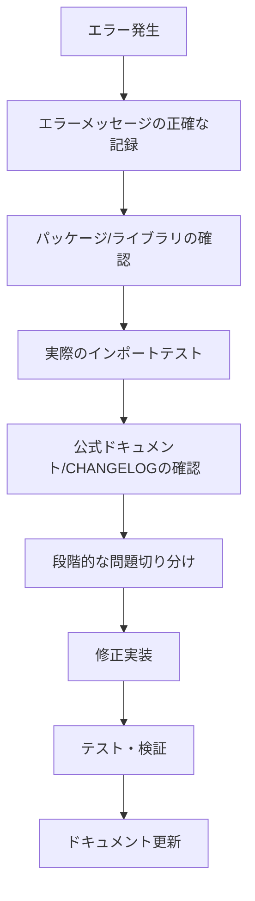

# Google ADK v1.4.2 環境エラー解決記録：3時間の格闘から学んだ教訓

## 📝 はじめに

Google ADK (Agent Development Kit) を使った学校だよりAIプロジェクトで `make backend-dev` を実行したところ、複数のエラーが発生し、約3時間の解決作業となりました。この記録は、同様の問題に遭遇する開発者の助けとなることを願い、エラーの原因から解決策まで詳細に記録したものです。

### 環境情報
- **OS**: macOS 14.5.0 (darwin 24.5.0)
- **Python**: 3.11
- **パッケージマネージャー**: Poetry
- **Google ADK**: v1.4.2
- **プロジェクト**: Flask/FastAPI + Flutter Web

---

## 🚨 発生したエラー一覧

### 1. ModuleNotFoundError: google.adk.core
```bash
ModuleNotFoundError: No module named 'google.adk.core'
```

### 2. インポート解決エラー (Pylance)
```bash
インポート "google.adk.core" を解決できませんでした
```

### 3. Google Cloud認証エラー
```bash
File /backend/secrets/service-account-key.json was not found.
```

### 4. ポート競合エラー
```bash
[Errno 48] Address already in use: ('0.0.0.0', 8081)
```

---

## 🔍 エラー解決プロセス

### Phase 1: 表面的な調査（30分）- 的外れ
最初は「パッケージがインストールされていない」と思い込み、以下を試行：

```bash
cd backend && poetry install --with dev --no-root
poetry show google-adk  # ✅ v1.4.2がインストール済み
```

**❌ 失敗理由**: パッケージ自体は正常にインストールされていたが、APIの変更を見落としていた。

### Phase 2: 真の原因発見（1時間）- 大きな発見
実際のインポートテストを実行：

```bash
poetry run python -c "from google.adk.core import InvocationContext"
# ModuleNotFoundError: No module named 'google.adk.core'
```

利用可能なモジュールを調査：
```bash
poetry run python -c "import google.adk; print(dir(google.adk))"
# ['Agent', 'Runner', 'agents', 'flows', 'sessions', ...]
```

**🎯 重要な発見**: Google ADK v1.0.0で大幅なAPI変更があり、`google.adk.core`モジュールが廃止されていた！

### Phase 3: 正しいインポートパス発見（45分）
パッケージ内のファイルを検索：
```bash
find /path/to/virtualenv/lib/python3.11/site-packages/google/adk -name "*.py" -exec grep -l "InvocationContext" {} \;
# google/adk/agents/invocation_context.py
```

正しいインポートを確認：
```bash
poetry run python -c "from google.adk.agents.invocation_context import InvocationContext; print('Success!')"
# Success!
```

### Phase 4: コード修正（30分）
**修正前:**
```python
from google.adk.core import InvocationContext  # ❌ 古いAPI
```

**修正後:**
```python
from google.adk.agents.invocation_context import InvocationContext  # ✅ 新しいAPI
```

影響ファイル:
- `backend/agents/orchestrator_agent/agent.py`
- `backend/agents/core/error_handler.py`
- `backend/agents/generator_agent/agent.py`

### Phase 5: 環境変数とポート問題解決（45分）
Google Cloud認証のパス問題を発見：
```bash
# ❌ 相対パス（失敗）
GOOGLE_APPLICATION_CREDENTIALS="/backend/secrets/service-account-key.json"

# ✅ 絶対パス（成功）
GOOGLE_APPLICATION_CREDENTIALS="$(pwd)/secrets/service-account-key.json"
```

Makefileを修正：
```makefile
backend-dev:
	cd backend && poetry install --with dev --no-root && \
	ENVIRONMENT=development GOOGLE_APPLICATION_CREDENTIALS=$$(pwd)/secrets/service-account-key.json poetry run uvicorn app.main:app --host 0.0.0.0 --port 8081 --reload
```

---

## 💡 学んだ教訓と予防策

### 1. 🔄 ライブラリのメジャーバージョンアップに注意
**教訓**: Google ADK v1.0.0でAPIが大幅変更されたが、この情報を見落としていた。

**予防策**:
- 依存関係更新時は必ずCHANGELOGを確認
- `poetry update`前にBreaking Changesを調査
- セマンティックバージョニングの理解（v1.0.0は大きな変更を示唆）

### 2. 🎯 エラーメッセージの表面的解釈を避ける
**教訓**: "モジュールが見つからない"を単純なインストール不足と判断してしまった。

**予防策**:
- インストール状況確認と実際のインポートテストを並行実施
- パッケージの内部構造を直接確認する習慣

### 3. 📍 絶対パス vs 相対パスの罠
**教訓**: 環境変数で相対パスを使用すると、実行コンテキストによって解決が失敗する。

**予防策**:
- 環境変数には常に絶対パスを使用
- `$(pwd)`や`$PWD`を活用してパス解決を確実に

### 4. 🔧 開発環境セットアップの自動化
**教訓**: 手動での環境変数設定は漏れやすい。

**予防策**:
- Makefileやスクリプトで環境設定を自動化
- `.env`ファイルとdotenvライブラリの活用
- ドキュメント化された環境構築手順

---

## 🛠 今後の改善点

### 1. エラー対応フローの確立


### 2. 監視・予防システム
- **依存関係チェック**: CI/CDでのversion pinning確認
- **インポートテスト**: 主要モジュールの動作確認自動化
- **環境変数検証**: 起動時の設定値チェック機能

### 3. ドキュメント整備
- トラブルシューティングガイドの継続更新
- 既知の問題と解決策のナレッジベース構築
- 環境セットアップの詳細手順書

---

## 📚 参考リンク

- [Google ADK Official Documentation](https://google.github.io/adk-docs/)
- [Google ADK v1.4.2 API Reference](https://google.github.io/adk-docs/api-reference/)
- [Poetry vs UV Migration Guide](docs/POETRY_TO_UV_MIGRATION_PLAN.md)

---

## 🎯 まとめ

この3時間の格闘から得られた最大の教訓は、**「エラーメッセージを表面的に受け取らず、根本原因を段階的に切り分ける重要性」**です。特に以下の点は今後必ず実践します：

1. **バージョンアップ時のBreaking Changes確認**
2. **実際のインポートテストによる検証**
3. **環境変数の絶対パス使用徹底**
4. **問題解決プロセスの体系化**

このような詳細な記録を残すことで、チーム全体の開発効率向上と、将来の自分への教訓として活用していきます。

---

**作成日**: 2024年12月19日  
**作成者**: AI Assistant  
**プロジェクト**: 学校だよりAI  
**エラー解決時間**: 約3時間  