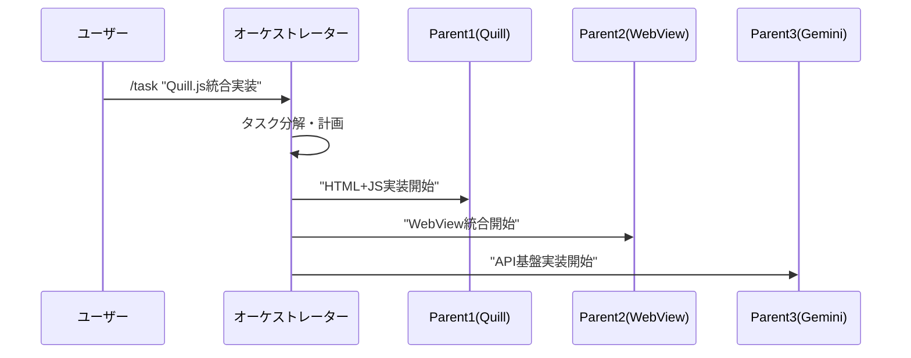
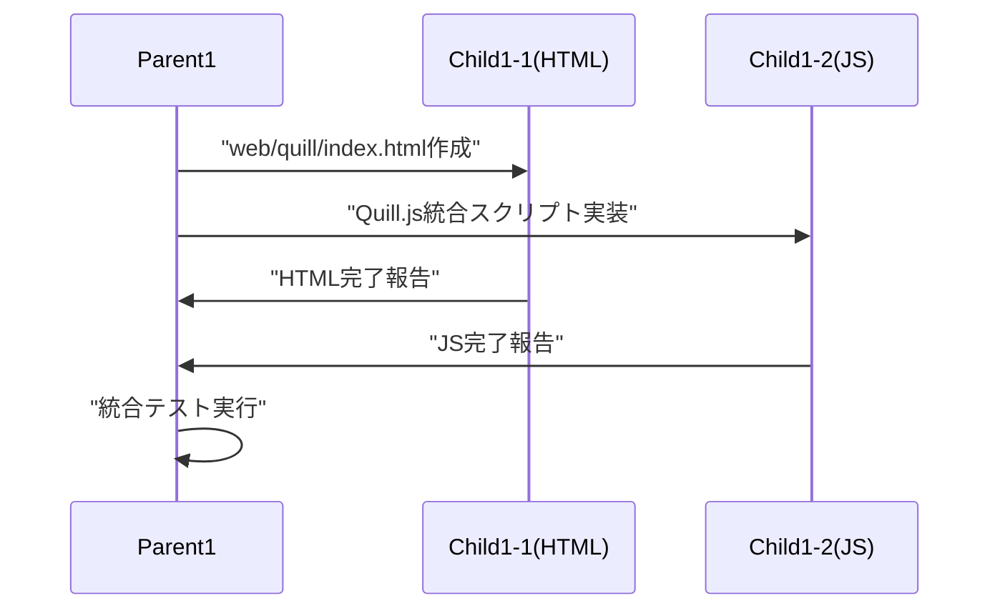

# Claude Code オーケストレーター設計書

**カテゴリ**: DESIGN | **レイヤー**: DETAIL | **更新**: 2025-01-15  
**担当**: AI Assistant | **依存**: なし | **タグ**: #claude-code #orchestrator #tmux #git-worktree

## 🎯 TL;DR（30秒で読める要約）

- **目的**: Claude Code統合オーケストレーター中心の並列開発環境
- **対象**: 開発者・AIエージェント管理者
- **成果物**: 3親+6子=9ペイン統合開発環境
- **次のアクション**: tmux配置最適化とスクリプト実装

## 📊 システム概要

### アーキテクチャ図
```
ユーザー
   ↓ (Claude Codeコマンド)
オーケストレーター (Claude Code)
   ↓ (タスク分解・指示送信)
┌─────────────────────────────────────────┐
│  TMUX Session: orchestrator             │
│  Window: main                           │
│                                         │
│  ┌──Parent1──┬──Child1-1──┬──Child1-2─┐│
│  │  Quill.js │   HTML     │    JS     ││
│  │   Boss    │  Worker    │  Worker   ││
│  ├──Parent2──┼──Child2-1──┼──Child2-2─┤│
│  │  WebView  │  Flutter   │  Bridge   ││
│  │   Boss    │  Worker    │  Worker   ││
│  ├──Parent3──┼──Child3-1──┼──Child3-2─┤│
│  │  Gemini   │   API      │ Response  ││
│  │   Boss    │  Worker    │  Worker   ││
│  └───────────┴────────────┴───────────┘│
└─────────────────────────────────────────┘
```

### ペイン配置図（3縦×3横）
```
┌─────────┬─────────┬─────────┐
│ Parent1 │Child1-1 │Child1-2 │  ← Row 1: Quill.js Team
│ Quill   │  HTML   │   JS    │
├─────────┼─────────┼─────────┤
│ Parent2 │Child2-1 │Child2-2 │  ← Row 2: WebView Team  
│ WebView │ Flutter │ Bridge  │
├─────────┼─────────┼─────────┤
│ Parent3 │Child3-1 │Child3-2 │  ← Row 3: Gemini Team
│ Gemini  │   API   │Response │
└─────────┴─────────┴─────────┘
```

## 🏗️ 技術仕様

### Git Worktree戦略
```bash
# 親用Worktree（3つのみ）
../yutori-parent-quill     (feat/parent-quill)
../yutori-parent-webview   (feat/parent-webview)  
../yutori-parent-gemini    (feat/parent-gemini)

# 子エージェントは親のサブディレクトリで管理
parent-quill/
  ├── html/     # Child1-1作業領域
  ├── js/       # Child1-2作業領域
  └── shared/   # 共通リソース

parent-webview/
  ├── flutter/  # Child2-1作業領域
  ├── bridge/   # Child2-2作業領域
  └── shared/

parent-gemini/
  ├── api/      # Child3-1作業領域
  ├── response/ # Child3-2作業領域
  └── shared/
```

### Tmux配置ルール
```bash
# セッション作成
tmux new-session -d -s orchestrator

# ペイン分割（3行×3列）
# Row 1: Quill.js Team
tmux split-window -h  # Parent1 | Child1-1
tmux split-window -h  # Parent1 | Child1-1 | Child1-2

# Row 2: WebView Team  
tmux select-pane -t 0
tmux split-window -v  # Parent2 (下に追加)
tmux select-pane -t 2  
tmux split-window -v  # Child2-1 (下に追加)
tmux select-pane -t 4
tmux split-window -v  # Child2-2 (下に追加)

# Row 3: Gemini Team
tmux select-pane -t 1
tmux split-window -v  # Parent3 (下に追加)
tmux select-pane -t 4
tmux split-window -v  # Child3-1 (下に追加)  
tmux select-pane -t 6
tmux split-window -v  # Child3-2 (下に追加)
```

## 🔄 通信プロトコル

### フロー1: タスク開始


### フロー2: 親→子指示


### コマンド送信方式
```bash
# オーケストレーター → 親エージェント
send_to_parent() {
    local parent_id=$1
    local command=$2
    local pane_id=$((parent_id - 1)) # 0,1,2
    
    tmux send-keys -t orchestrator:0.$pane_id "$command" Enter
    echo "[ORCHESTRATOR→PARENT$parent_id] $command"
}

# 親エージェント → 子エージェント  
send_to_child() {
    local parent_id=$1
    local child_num=$2  # 1 or 2
    local command=$3
    local pane_id=$((parent_id * 2 + child_num - 1))
    
    tmux send-keys -t orchestrator:0.$pane_id "$command" Enter
    echo "[PARENT$parent_id→CHILD$parent_id-$child_num] $command"
}
```

## 📋 実装仕様

### Claude Codeコマンド統合
```bash
# オーケストレーター用カスタムコマンド
/task <description>     # タスク分解・配布
/status                 # 全エージェント状態確認
/parent <id> <command>  # 特定親への直接指示
/child <p-id> <c-id> <command>  # 特定子への直接指示
/report                 # 完了報告収集
/reset                  # 全エージェントリセット
```

### ファイル配置
```
scripts/
├── orchestrator_setup.sh       # 環境セットアップ
├── orchestrator_start.sh       # システム起動
├── orchestrator_commands.sh    # コマンドライブラリ
├── parent_manager.sh           # 親エージェント管理
├── child_manager.sh            # 子エージェント管理
├── communication.sh            # 通信ユーティリティ
└── monitor.sh                  # 監視・ログ

configs/
├── orchestrator.md             # オーケストレーター指示書
├── parent_templates/           # 親エージェント設定
│   ├── quill_parent.md
│   ├── webview_parent.md
│   └── gemini_parent.md
└── child_templates/            # 子エージェント設定
    ├── html_worker.md
    ├── js_worker.md
    ├── flutter_worker.md
    ├── bridge_worker.md
    ├── api_worker.md
    └── response_worker.md
```

## 🎯 実装優先順位

### Phase 1: 基盤構築
1. **tmux配置最適化** (30分)
   - 3×3ペイン配置の実装
   - ペイン番号とエージェントマッピング

2. **Git Worktree簡素化** (20分)
   - 親用3Worktreeのみ作成
   - 子エージェント用サブディレクトリ構造

3. **通信ライブラリ** (40分)
   - send_to_parent関数
   - send_to_child関数
   - 状態確認機能

### Phase 2: Claude Code統合
1. **カスタムコマンド** (60分)
   - /taskコマンド実装
   - /statusコマンド実装
   - /reportコマンド実装

2. **指示書テンプレート** (30分)
   - 各エージェント役割定義
   - 通信フォーマット標準化

### Phase 3: 監視・管理
1. **リアルタイム監視** (45分)
   - ログ集約システム
   - 進捗ダッシュボード

2. **エラーハンドリング** (30分)
   - 通信失敗時の復旧
   - エージェント再起動機能

## 🔍 従来システムとの比較

| 項目 | 従来(v3.0) | 新設計(Orchestrator) |
|------|------------|---------------------|
| エージェント数 | 13 (1+3+9) | 7 (1+3+3×2) |
| Tmuxペイン数 | 13 | 9 |
| Git Worktree | 13個 | 3個 |
| 管理複雑度 | 高 | 中 |
| Claude Code統合 | なし | ネイティブ |
| 通信経路 | 複雑 | シンプル |
| デバッグ容易度 | 困難 | 容易 |

## ✅ 実装チェックリスト

### 基盤システム
- [ ] tmux 3×3ペイン配置実装
- [ ] Git Worktree 3個作成
- [ ] ペイン↔エージェントマッピング
- [ ] 通信ライブラリ実装

### Claude Code統合  
- [ ] カスタムコマンド開発
- [ ] タスク分解エンジン
- [ ] 指示送信システム
- [ ] 完了報告収集

### 管理・監視
- [ ] リアルタイム状態確認
- [ ] ログ集約システム
- [ ] エラーハンドリング
- [ ] 復旧機能

---

**次のアクション**: orchestrator_setup.sh の実装開始 